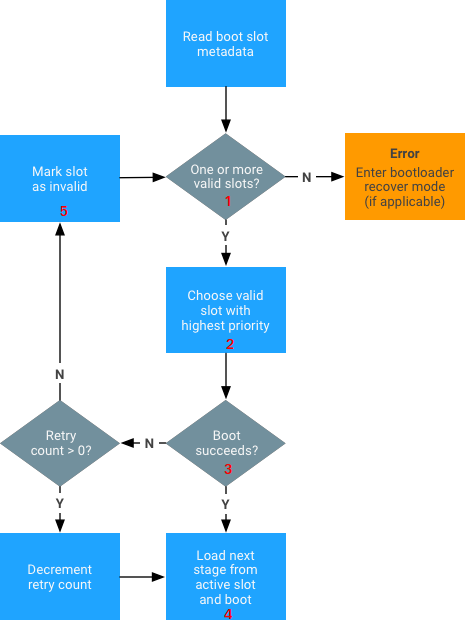
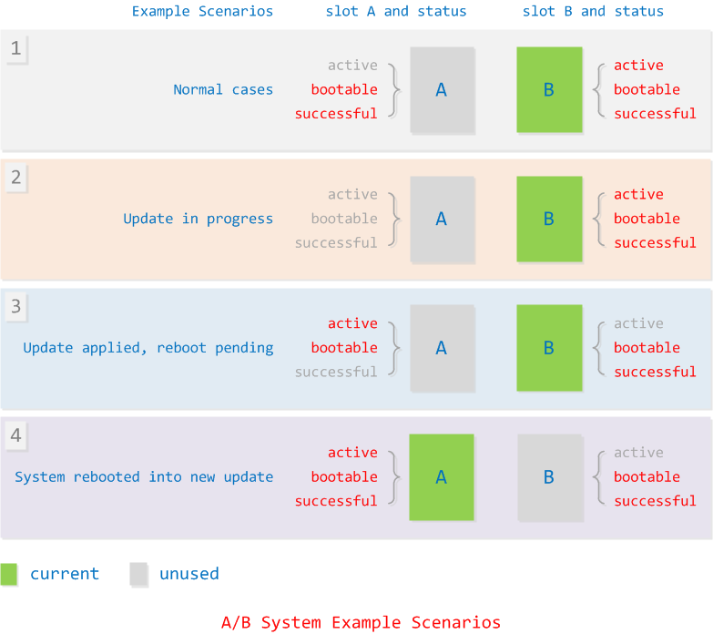
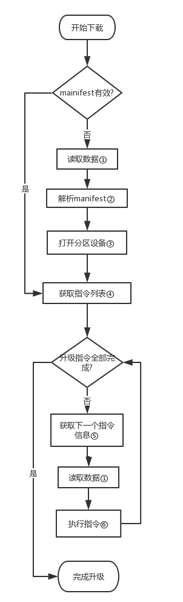
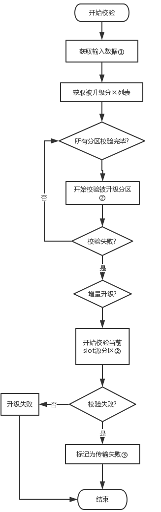
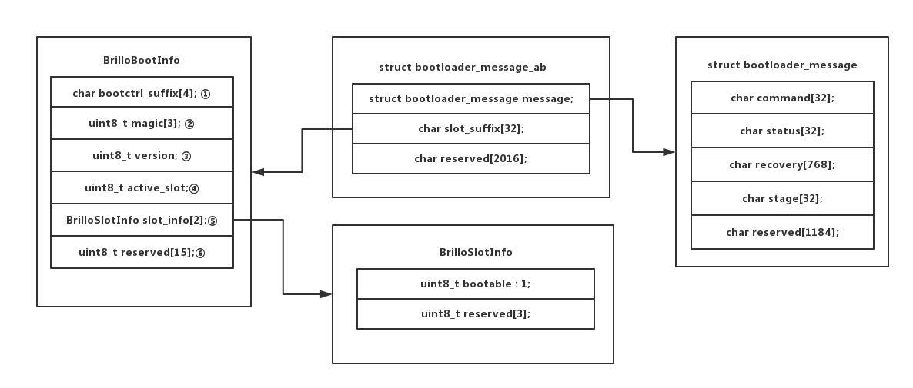

# <font color="blue"> A/B系统简介 </font> #
<br>
顾名思义, `A/B`系统就是指终端设备上存在两套系统,(userdata只有一份, 被两套系统共用). 简单来讲, 可以理解为, 存在一套系统分区, 一套备份分区, 两套系统都可以被启动, 两套系统的版本号可以一样, 也可以一套旧, 一套新. 而升级就是将旧的系统升级到新版本.

A/B系统实现了无缝升级(Seamless System Updates), 存在如下特点:

* 终端设备在出厂时有两套设备可以工作, 在升级出现异常或者出错时, 始终确保系统存在一套设备可以正常工作.
* 系统在后台进行升级, 更新到另一套系统, 用户不会被打断. 在更新完成后, 用户在下次重启手机时, 就会进入新系统.
* 在 dm-verity 或者其他校验方式检测到系统顺坏或异常后, 可以重启回到升级前的系统, 确保用户使用不受影响.

Android8.0的代码编译时, 在BoardConfig有对应的选项来控制是编译成A/B系统还是正常单系统. 由于新系统跟原来的OTA升级系统存在大不同, 导致无法通过以前的OTA升级方式(安全地)升级到A/B系统.

而A/B系统升级, 是由运行于Android后台的`update_engine`和 `slot a`, `slot b`两套系统共同完成. 在启动其中一套系统的情况下, `update_engine`在后台与服务器通信下载升级流并更新到另一套系统.

A/B 系统升级主要涉及如下4个方面:

* 分区选择(slots), 即选择哪个系统.
* `update_engine`, 即升级流下载和升级
* bootloader交互, 即如何通知bootloader切换slot
* ota包生成.
<br>

# <font color="blue"> 分区选择 </font> #

<br>

## <font color="green">分区表和分区内容变化</font> ##

<br>

详细内容请参考 `Android8 分区表和分区相关操作`. 这里简单总结下分区表上跟单系统的差异.
这里以boot,system, vendor和modem存在两套系统为例子, 其余分区按照最小分区表.

| 单系统分区表 | A/B系统分区表 | 功能描述 |
| ---- | ---- | ---- |
| bootloader | bootloader | 引导linux系统 |
| misc | misc | Android系统与recovery, bootloade通信的数据 |
| boot | -   | 存放Android的kernel和ramdisk |
| -    | boot_a | 存放Android的kernel和单系统中recovery的ramdisk |
| -    | boot_b | 存放Android的kernel和单系统中recovery的ramdisk |
| system | - | Android系统应用, 库和资源文件. |
| - | system_a | 存放单系统boot中的ramdisk和system中的应用, 库和资源文件 |
| - | system_b | 存放单系统boot中的ramdisk和system中的应用, 库和资源文件 |
| - | vendor_a | 存放厂商的配置, 可执行程序, 库, 目录结构与/system/一致 |
| - | vendor_b | 存放厂商的配置, 可执行程序, 库, 目录结构与/system/一致 |
| cache | - | 临时存放数据, 通常临时存放下载, 备份和升级包 |
| recovery | - | 存放recovery系统的kernel和ramdisk |
| userdata | userdata | 存放用户数据 | 

所谓的A/B系统分区, 就是在原有分区名字后吗添加`_a` 和 `_b`, 在刷机, 或者系统启动的时候, 根据bootloader的参数添加后缀, 选择正确的系统. misc分区在A/B系统中变成一个可有可无的存在, 因为其功能只是传递恢复出厂设置的参数, 而recovery的功能也只剩下恢复出厂设置, 所以, 本质上, 没必要再基于misc传递参数了.
<br>

## <font color="green">系统分区属性</font> ##
<br>
bootloader为了判断一个系统(slot)是否为可以启动的状态, 需要为其定义对应的属性(状态). 其状态说明如下:

* active. 活动分区标识, 排他, 代表该分区为启动分区, bootloader总会选择该分区.
* bootable. 表示该slot的分区存在一套可能可以启动的系统.
* successful. 表示该slot的系统能正常启动.
* unbootable. 代表该分区损坏的, 无法启动, 在升级过程总被标记, 该标记等效于以上标记被清空. 而active标记会将该标记清空.

`slot a` 和 `slot b`, 只有一个是active, 它们可以同时有 bootable 和 successful 属性.


1. bootloader检测到1个或者2个slot都是bootable的状态.
2. 选择active的slot或者选择successful的slot进行尝试启动.
3. 启动成功的标记是, dm-verity 成功.
4. 由于启动成功, 则该slot被标记为successful和active
5. 由于启动失败, 则设置该slot为unbootable, 并设置另一个slot为active, 进行下一次尝试.


<br>

# <font color="blue">升级流下载和升级</font> #
<br>

首先, 我们看下升级包的内容. 在A/B升级的情况下, 升级包内容如下:
```
Path = aosp_marlin-ota-eng.builder.zip
Type = zip
Comment = signed by SignApk
Physical Size = 384694679

   Date      Time    Attr         Size   Compressed  Name
------------------- ----- ------------ ------------  ------------------------
2009-01-01 00:00:00 .....          360          360  META-INF/com/android/metadata
2009-01-01 00:00:00 .....          107          107  care_map.txt
2009-01-01 00:00:00 .....    384690699    384690699  payload.bin
2009-01-01 00:00:00 .....          154          154  payload_properties.txt
2009-01-01 00:00:00 .....         1675          943  META-INF/com/android/otacert
------------------- ----- ------------ ------------  ------------------------
                             384692995    384692263  5 files, 0 folders
```
<br>

下载和升级程序是`update_engine`, 来自chrome os, 代码中大量存在dbus和chrome os的痕迹, 而Android上改程序是基于binde进行通信. 与原先的ota升级不同, 该升级包中不包含updater, 也就是说, 升级的逻辑在设备端而不是在升级包中. 如果熟悉ota升级的话, 这个升级包中的数据跟块升级数据几乎一样, 初步判断用的是块升级.
那么, 如果有新的需求, 比如此次更新需要调整数据库, 是如何做到的? 请查看后文第二步升级.
<br>

整个升级分为五步:

* 下载升级包, 或者升级流. Android8 新支持了流式升级, 可以边下边升.
* 第一步升级. 也就是, `update_engine`执行的升级逻辑, 基本的数据写入.
* 校验写入数据. 确保上一步写入数据可靠完整.
* 第二步升级. 也就是, 挂载新烧写的分区, 并执行其中的指定脚本(程序)进行后续更新操作.
* 应用优化.  由于存在A/B新旧两套系统, 所以, data底下也存在两套odex/vdex.

前4步, 基于一种pipe的框架实现, 每一步都是一个action, 别链接到actio list中, 前后两个action通过pipe机制进行数据通信. 也就是说, 前一个action的输出默认变成后一个action的输入. action的执行函数是`PerformAction()`. 通过`HasInputObject()`和`HasOutputPipe()`判断是否有输入和输出流, 而`GetInputObject()`接`SetOutputObject()`分别是读取和写入pipe.

`update_engine` 的 Androidmk目标, 依赖和对应源码文件如下.
```
# 静态库模块
STATIC_LIBRARIES:
    update_metadata-protos      (host, target)
    libpayload_consumer         (host, target)
    libupdate_engine_android    (target)
    libpayload_generator        (host, target)

# 可执行模块
EXECUTABLES:
    update_engine           (target)
    update_engine_sideload      (target)
    update_engine_client        (target)
    delta_generator         (host)

# 共享库模块
SHARED_LIBRARIES:
    libupdate_engine_client     (target)

# 预编译模块
PREBUILT:
    updater.json            (target)
    brillo_update_payload       (host)
```

从上文的目标可以获取如下信息:

1. payload 中的文件结构是protos
2. 可执行文件是 `update_engine`, 而 `update_engine_client` 是客户端, `update_engine_sideload` 是recovery模式下通过usb更新.
3. `delta_generator` 用于生成payload
4. 完整的Android.mk中, 存在标记为`local_use_omaha`, 只有在 `PRODUCT_IOT` 物联网时, 才启用, 编译获得的是dbus版本的`update_engine`.

依赖关系如下:

```
update_engine (target)
  --> libupdate_engine_android
    --> libpayload_consumer
      --> update_metadata-protos

update_engine_sideload (target)
  --> update_engine_sideload
    --> update_metadata-protos

update_engine_client (target)

delta_generator (host)
  --> libpayload_generator
    --> libpayload_consumer
      --> update_metadata-protos
```

源码列表如下:

```
update_metadata-protos (STATIC_LIBRARIES)
  --> update_metadata.proto

libpayload_consumer (STATIC_LIBRARIES)
  --> common/action_processor.cc
      common/boot_control_stub.cc
      common/clock.cc
      common/constants.cc
      common/cpu_limiter.cc
      common/error_code_utils.cc
      common/hash_calculator.cc
      common/http_common.cc
      common/http_fetcher.cc
      common/file_fetcher.cc
      common/hwid_override.cc
      common/multi_range_http_fetcher.cc
      common/platform_constants_android.cc
      common/prefs.cc
      common/subprocess.cc
      common/terminator.cc
      common/utils.cc
      payload_consumer/bzip_extent_writer.cc
      payload_consumer/delta_performer.cc
      payload_consumer/download_action.cc
      payload_consumer/extent_writer.cc
      payload_consumer/file_descriptor.cc
      payload_consumer/file_writer.cc
      payload_consumer/filesystem_verifier_action.cc
      payload_consumer/install_plan.cc
      payload_consumer/payload_constants.cc
      payload_consumer/payload_verifier.cc
      payload_consumer/postinstall_runner_action.cc
      payload_consumer/xz_extent_writer.cc

libupdate_engine_android (STATIC_LIBRARIES)
  --> binder_bindings/android/os/IUpdateEngine.aidl
      binder_bindings/android/os/IUpdateEngineCallback.aidl
      binder_service_android.cc
      boot_control_android.cc
      certificate_checker.cc
      daemon.cc
      daemon_state_android.cc
      hardware_android.cc
      libcurl_http_fetcher.cc
      network_selector_android.cc
      proxy_resolver.cc
      update_attempter_android.cc
      update_status_utils.cc
      utils_android.cc

update_engine (EXECUTABLES)
  --> main.cc

update_engine_sideload (EXECUTABLES)
  --> boot_control_android.cc
      hardware_android.cc
      network_selector_stub.cc
      proxy_resolver.cc
      sideload_main.cc
      update_attempter_android.cc
      update_status_utils.cc
      utils_android.cc
      boot_control_recovery_stub.cc

update_engine_client (EXECUTABLES)
  --> binder_bindings/android/os/IUpdateEngine.aidl
      binder_bindings/android/os/IUpdateEngineCallback.aidl
      common/error_code_utils.cc
      update_engine_client_android.cc
      update_status_utils.cc

libpayload_generator (SHARED_LIBRARIES)
  --> payload_generator/ab_generator.cc
      payload_generator/annotated_operation.cc
      payload_generator/blob_file_writer.cc
      payload_generator/block_mapping.cc
      payload_generator/bzip.cc
      payload_generator/cycle_breaker.cc
      payload_generator/delta_diff_generator.cc
      payload_generator/delta_diff_utils.cc
      payload_generator/ext2_filesystem.cc
      payload_generator/extent_ranges.cc
      payload_generator/extent_utils.cc
      payload_generator/full_update_generator.cc
      payload_generator/graph_types.cc
      payload_generator/graph_utils.cc
      payload_generator/inplace_generator.cc
      payload_generator/payload_file.cc
      payload_generator/payload_generation_config.cc
      payload_generator/payload_signer.cc
      payload_generator/raw_filesystem.cc
      payload_generator/tarjan.cc
      payload_generator/topological_sort.cc
      payload_generator/xz_android.cc

delta_generator (EXECUTABLES)
  --> payload_generator/generate_delta_main.cc
```


## <font color="green"> 下载 </font> ##

下载相关与服务器交互的逻辑: `delta_performer.cc`

升级流(包)的下载, 分为两个模式:

* 下载zip包到data分区.
* 下载升级流, 边下边升级.

( 从chrome os代码看, 其升级服务器是omaha server, 可以参考看下对于我们的升级服务器是否有帮助.
https://github.com/Crystalnix/omaha-server
https://github.com/Crystalnix/omaha-server/wiki
)

payload 数据结构:


```
version 1:
| 'C''r''A''U' | version(8) | manifestSize(8) | manifest(manifestSize) | rawData | payloadSignatureMessageSize | payloadSignatureMessage(payloadSignatureMessageSize) |

version 2:
| 'C''r''A''U' | version(8) | manifestSize(8) | MetadataSignatureSize(4) | manifest(manifestSize) | medatadataSignatureMessage(MetadataSignatureSize) | rawData | payloadSignatureMessageSize | payloadSignatureMessage(payloadSignatureMessageSize) |
```

其中 medatadataSignatureMessage 校验的是其之前的所有数据, 而 payloadSignatureMessage 校验的是 payloadSignatureMessageSize 之前的所有数据.

而 manifest 是protobuff, 其中包含一组指令集, 也就是以前recovery 块升级的一系列指令. rawData是被更新数据, 指令会从rawData指定位置读取数据并应用到目标分区的指定位置.

metadata的数据是protobuf, 数据结构为 update_metadata.proto

下载存在两种模式, p2p和普通下载.


下载到data分区的逻辑与之前ota升级下载升级包的逻辑一致. `update_engine`将升级包下载到本地.  下面先介绍边下边升级的逻辑.

### 下载到data分区 ###

下载到data分区的实现不再`update_engine`中, 而如果是预先下载完成的payload, 通过`file://`的url传递给`update_engine`, 后续逻辑与边下边升级一样.

而java层的UpdateEngine.java的API, 暴露到了系统的jar包中, 并未找到调用者, 也就是说, 这块逻辑是非开源的, 我们无法获得.


### 边下边升 ###
所谓边下边升, 就是将升级数据下载到内存中, 并在内存中完成相应处理, 最后写入目标分区.
<br>
下面是边下边升的客户端执行命令.

```
# update_engine_client \
--payload=http://xxx/android/full-ota/payload.bin \
--update \
--headers="\
  FILE_HASH=ozGgyQEddkI5Zax+Wbjo6I/PCR8PEZka9gGd0nWa+oY= \
  FILE_SIZE=282344983
  METADATA_HASH=GLIKfE6KRwylWMHsNadG/Q8iy5f786WTatvMdBlpOPg= \
  METADATA_SIZE=26723 \
"
```

在Pixel手机上升级的输出log如附件[update_engine.log](/api/file/getAttach?fileId=5a32434732acd20ed4000079), 感兴趣的童鞋可以看下, 其中包含了各个阶段的行为.

其中header后面的内容, 跟升级包中的`payload_properties.txt` 文件内容一样. 各字段的作用可以参考前文payload的头数据格式来理解具体校验的数据位.


`update_engine` 首先定义一系列的action:

* `download_action`: 下载模块, 负责边下边升级.
* `filesystem_verifier_action`: 文件系统校验模块, 负责升级完成后校验数据的完整性
* `postinstall_runner_action`: 后升级模块, 一些脚本或可执行程序在系统升级完成后执行.

以上action通过类似pipeline的形式组织, 前一个action的输出作为后一个action的输入. 而在其中传递的数据是`install_plan_`, 该数据包含了payload(升级数据)的所有信息(操作分区, url, 校验信息等), 部分信息由后面的action执行后提供.
所有的action, 其执行入口函数是`PerformAction()`, 通过这个函数, 可以更细致地了解输入输出数据和该action的具体功能.

本段内容着重介绍`download_action`, 其余模块在后面介绍.
<br>

<br>
1. 读取数据. 这里并不是正常的read, 该函数是个下载的Write回调, 而读取数据在代码上的真实行为是, 返回错误表示数据不够, 继续读取, 而已经读取的数据存放在buffer中.
2. 解析manifest. 就是上文中payload的头, 包含校验信息和执行的指令集, 还有所有操作的分区校验值等.
3. 打开分区设备. 根据升级类型, 如果是全量升级(manifest中包含该信息), 则打开被升级设备分区, 如果是增量升级, 打开当前运行设备分区和被升级目标分区.
4. 获取指令列表. 是从manifest中获取. 不同指令, 格式不同, 但基本格式是 `src:offset:size`, 指定操作源/目标, 偏移和大小.
5. 由于1提到的, 在数据不够时会退出, 所以, 会保存当前已经执行到的指令, 并获取下一个指令信息, 这里信息重点是, 需要读取的payload中offset和size. 由于payload中的升级数据是跟指令一起生成的, 所以, 其数据的偏移完全可以跟指令的顺序一致, 保证不会出现读指针跳动, 也就不需要p2p支持.
6. 执行指令. 基本指令可以查看代码, 与块升级指令一样.
<br>
下面是升级时数据的合成图.
<br>


这幅图展示的是升级数据的合成. 如果是全量升级, source为空, 则payload直接写入target. 但与一般分区烧写还是有些差异, 并不会擦除target, 而是按照偏移和大小直接写入.而如果是增量升级, 则是基于当前运行系统为source, 与payload的数据合并写入target.

所以, 不管是全量升级还是增量升级, 断电后都可以从头开始再升级.


## <font colo="green"> 校验 </font> ##
<br>

<br>

1. 获取输入数据. 是指获取从`download_action`完成后的数据, 包含被升级分区及其哈希值等.
2. 开始校验被升级分区. 单纯从分区读取块数据并与payload中存放的进行比对校验.
3. 开始校验当前slot源分区. 这个是针对增量升级的. 在校验目标分区失败后, 校验源分区.此处校验的目的不是判断当前运行的分区是否合法(启动时, 由其他模块校验), 而是判断下载的payload是否与当前系统匹配(服务器端放错升级文件).
4. 标记传输失败. 这里是在3的基础上, 将当前payload的下载url标记失败, 并增加失败次数. 在达到一定次数后(服务端配置), 不再从该url获取升级数据, 跳往下一个url.


## <font colo="green"> post install </font> ##

各个分区都可以指定postinstall, 而postinstall脚本是在`download_action`解析mainifest时解析并获得. 在定义执行postinstall但又无脚本指定时, 默认postinstall脚本是分区根目录下的`postinst`

在Chrome OS中, postinstall 是允许对分区执行块写入操作的,但是在Android, 挂载分区被执行标记为只读, 并且也挂载成只读, 也就是说, 不允许对被升级分区做修改(就算修改了, 之后校验依然可能出错). postinstall的脚本是直接基于当前被升级系统执行, 并未chroot, 所以, postinstall脚本必须能够被保证运行在被升级系统中. 所以, 一般是纯静态的可执行程序, 而且其功能在android上也被弱化了.

## <font colo="green"> odex优化 </font> ##

在以上全部完成后, 系统将标记slot为被升级系统, 并在下次重启后, 进入升级后的系统, 校验并优化. 这时候如果校验失败, 则还会回到原先系统. 则该情况存在data下应用数据已经被优化为新版本或者优化到一半的问题. 跟了下相关代码和网上的资料, 结论如下.
<br>
在A/B升级完成进入新系统后, dexopt的参数是speed-profile, 而该参数的含义就是根据“热代码”的profile配置来编译. 那么问题就是这个profile的生成,和什么时候执行增量编译.

 1. profile在达到一定条件后写入/data/, 目前从代码看, 已知的一个条件是大小>50K时, 写入文件. 而在已经存在该文件的情况下, 会优先加载, 如果加载失败, 则删除并重新生成.
 2. 执行增量编译的时间是, 机在充电＋空闲＋四个小时间隔等多个条件下, 在后台完成.
<br>

也就是说, 在AB系统升级完成时, 不会执行编译, 只会执行profile的生成. 而在这个时候如果被检测到系统校验失败, 则会回到上一版本系统.

# <font color="blue">bootloader交互</font> #
<br>

传统的Android与bootloader通信是通过misc分区. 然而在A/B系统中, 数据并不是存在misc分区, 而且存放位置由厂商定义, 接口在`hardware/libhardware/include/hardware/boot_control.h`. 其结构体是 `boot_control_module_t`, 包含了所有设置以上slot状态的接口.

下面介绍下不同厂商`boot_control`的实现.
<br>
## qcom的实现 ##
<br>
代码位置:  `hardware/qcom/bootctrl/boot_control.cpp`
qcom的实现是, 直接将A/B分区的属性, 写入的gpt分区表的boot分区(`boot_a`和`boot_b`).qcom机顶盒gpt表的分析:http://blog.csdn.net/guyongqiangx/article/details/68924436
<br>

<br>
上图是qcom机顶盒gpt分区表的信息, 在Entry中查找到分区`boot_a`和`boot_b`, 提取其属性.
从 LAB 2 开始存放的是GPT分区的详细信息`Partition Entry`, 单个`Partition Entry`占128个字节, 从第48个字节开始存放的是分区属性, 而A/B系统的分区属性也是存放在这个位置.

从上图可以看到, qcom的实现, 没有bootable的标记位, 取而代之的是unbootable.
<br>
## google的参考实现 ##
<br>
代码位置`system/extras/boot_control_copy/boot_control_copy.c`

google的参考实现复用了misc分区的`bootloader_message`(recovery与bootloader通信的分区). 整个misc分区的数据结构图如下.
<br>

<br>

1. fsmgr使用, 在设置指定slot为active时, 同时将对应后缀设置到该字段. fsmgr在挂载分区时,通过该字段拼成完成的分区路径.
2. Magic Numbe. 用来确定该数据端的合法, 必须是 'B', 'C' , 'c' ("`boot_control` copy" 的缩写)
3. 接口版本号
4. active状态的slot号, 在该实现中只有 0 或 1.
5. 0 为 第一个slot, 1 为第二个slot, 设置slot的bootable/unbootable状态.


从上图可以看出, 并没有可以标记为successful的位, 通过代码也发现, 其实现为空, 也就是说, 并没有实现该状态.

如果注意到代码, 在`module_setActiveBootSlot`后半段, 会将active状态的`boot_X`分区内容拷贝到boot分区. 也就是说, 系统存在三个分区(boot, `boot_a`, `boot_b`), 被设置为active的分区会被拷贝到boot分区, 再结合`module_getCurrentSlot`的实现(从/system分区获取挂载信息) ,从这两段代码可以推测出两个结论:

* A/B系统可以不升级firmware(bootloader), 或者说google的该实现最初是为了兼容老的bootloader.
* boot.img中的ramdisk可以还是boot的ramdisk.

但是, 不确定参考代码是否能正常运行. 但是单纯从以上代码看, 除了分区, A/B系统的启动, 挂载, 都可以在用户层搞定. 但是带来的后果就是, 如果bootloader启动boot失败, 则无法切换到另一个slot.


# <font color="blue">升级包生成</font> #

升级包制作工具不再支持 基于文件的升级, 当前只支持ab升级和块升级.

块升级和ab升级在生成数据文件和脚本上原理是一样的, 只是在生成升级数据时存在差异.

AB升级payload制作逻辑在升级包制作脚本的`WriteABOTAPackageWithBrilloScript`, 而真正payload生成的逻辑在函数`GenerateUpdatePayloadFile`.

流程如下:


生成payload指令规则:


# <font color="blue">AB升级总流程图</font> #


