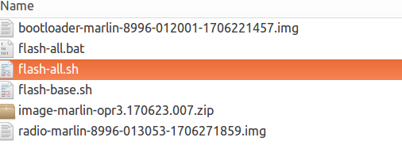
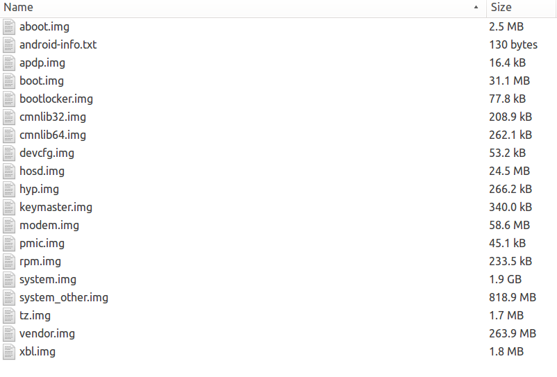

## <font color="blue">差异简述 </font> ##

在Android8.0之后, 就存在两套分区表, 分别对应的是A/B系统和非A/B系统.

* 非A/B系统的分区表与之前分区表一样, 没有变化.
* A/B系统的分区表, 是本文的主要描述点.

所谓的A/B系统, 是指设备上存在两套系统, 其分区名也是存在`_a` 和 `_b` 的区别.两套系统中, 只有一套为active, 运行状态, 而升级则执行在另一套系统的分区中. 从而达到, 不管升级成功与否, 总有一套系统保证能使用.

而刷机, 包括挂时的分区表中, 都不会添加后缀(`_a`或`_b`). 只有在fastboot刷机时, 或者在init挂载时, 找到active的slot, 在指定分区名字后面添加后缀并挂载. 所以, 单纯从源码或者刷机包是无法指定哪些分区被指定为A/B了.

<br>
A/B系统带来的好处是:

1. 无缝升级, 不需要再进入recovery进行升级.
2. 双系统备份, 不管是系统升级失败, 还是被破坏, 都可以切换到另一个系统, 确保用户设备的正常使用.


## <font color="blue">分区表与其内容</font> ##

下面主要针对pixel设备进行分析, 也就是Android8的源码中marlin设备.

### <font color="green">刷机文件和刷机方式 </font>###

首先我们看下android官网提供的marlin设备刷机文件. 下面是基带和bootloader的刷机文件.


<br>
zip包中的文件如下.
<br>


如果单纯按照之前对该zip包文件的理解, 文件名字就是对应的分区名. 然而在A/B系统中, 却并不是如此. 而是按照一定的规则查找A/B分区.

首先, 最先注意到的是两个system大小不一致, 但是这个展开来讲有点多, 我们先把A/B系统刷机的第一个规则介绍以下, 代码在后文介绍第二个规则时可以同时看到.

A/B系统fastboot刷机时, 如果没有指定slot, 则默认刷入的是active的slot, 比如如果bootloader标记为slot A 为active, 则所有分区默认刷入slot A, 也就是说`boot_a`, `system_a` 等. 但是, 如果bootloader反馈某个分区没有区分A/B, 则默认直接刷入该分区. 比如 vendor 无区分A/B, 则直接刷入vendor.

然后, 我们关注下`system.img`和`system_other.img`, 如果单纯理解为这两个image分别刷入A/B分区, 则大小也完全对应不上. 大小问题, 我们稍后再看, 先研究下`system_other.img`刷入哪个分区.

```
static struct {
    char img_name[17];
    char sig_name[17];
    char part_name[9];
    bool is_optional;
    bool is_secondary;
} images[] = {
    {"boot.img", "boot.sig", "boot", false, false},
    {"boot_other.img", "boot.sig", "boot", true, true},
    {"recovery.img", "recovery.sig", "recovery", true, false},
    {"system.img", "system.sig", "system", false, false},
    {"system_other.img", "system.sig", "system", true, true},
    {"vendor.img", "vendor.sig", "vendor", true, false},
    {"vendor_other.img", "vendor.sig", "vendor", true, true},
};
```

其中 ```is_secondary``` 如果为true, 则意味着输入非active slot.

```
    if (!skip_secondary) {         // 默认 false
        if (slot_override != "") {  // 刷机时 为 ""
            secondary = get_other_slot(transport, slot_override);
        } else {
            secondary = get_other_slot(transport); // 获取非active slot
        }
        if (secondary == "") {
            if (supports_AB(transport)) {
                fprintf(stderr, "Warning: Could not determine slot for secondary images. Ignoring.\n");
            }
            skip_secondary = true;
        }
    }
    for (size_t i = 0; i < arraysize(images); ++i) {
        const char* slot = slot_override.c_str();
        if (images[i].is_secondary) {
            if (!skip_secondary) {
                slot = secondary.c_str(); //指定为非active slot
            } else {
                continue;
            }
        }

        int fd = unzip_to_file(zip, images[i].img_name);
        if (fd == -1) {
            if (images[i].is_optional) {
                continue;
            }
            CloseArchive(zip);
            exit(1); // unzip_to_file already explained why.
        }
        fastboot_buffer buf;
        if (!load_buf_fd(transport, fd, &buf)) {
            die("cannot load %s from flash: %s", images[i].img_name, strerror(errno));
        }

        auto update = [&](const std::string &partition) {
            do_update_signature(zip, images[i].sig_name);
            if (erase_first && needs_erase(transport, partition.c_str())) {
                fb_queue_erase(partition.c_str());
            }
            flash_buf(partition.c_str(), &buf);
            /* not closing the fd here since the sparse code keeps the fd around
             * but hasn't mmaped data yet. The tmpfile will get cleaned up when the
             * program exits.
             */
        };
        do_for_partitions(transport, images[i].part_name, slot, update, false);
    }
```

所以, ```system_other.img``` 会刷入非active slot, 如果active为a. 则刷入`system_b`. 

在确定`system_other.img`会刷入另一个slot后, 按照第一个规则(只刷active的slot), 则可以基本猜测, `system_other.img`中的内容不是用于启动系统的, 或者不是完整系统.


对比, 其内容差异, `system_other.img` 中, 只有 app 和 `priv-app`目录.`system_other.img`的目录中只存在odex和vdex文件, 也就是app优化过的文件, 并且额外多一个文件`system-other-odex-marker`. 这个文件是个线索, 所以, 初步可以判断, 系统启动后一定会从`system_b`将这些数据复制到/data/下.

下面我们看下这个文件的作用和如何copy.
```
on property:sys.cppreopt=requested && property:ro.boot.slot_suffix=_a
    mount ext4 /dev/block/bootdevice/by-name/system_b /postinstall ro nosuid nodev noexec
    exec - root -- /system/bin/cppreopts.sh /postinstall
    # Optional script to copy additional preloaded content to data directory
    exec - system system -- /system/bin/preloads_copy.sh /postinstall
    umount /postinstall
    setprop sys.cppreopt finished

on property:sys.cppreopt=requested && property:ro.boot.slot_suffix=_b
    mount ext4 /dev/block/bootdevice/by-name/system_a /postinstall ro nosuid nodev noexec
    exec - root -- /system/bin/cppreopts.sh /postinstall
    # Optional script to copy additional preloaded content to data directory
    exec - system system -- /system/bin/preloads_copy.sh /postinstall
    umount /postinstall
    setprop sys.cppreopt finished
```

在启动为任何之一时, 会从另一个slot挂载到/postinstall, 然后使用cppreopts.sh, 将odexvdex文件拷贝到`/data/
dalvik-cache/<isa>/`xiam, isa是硬件架构(arm64/arm32).
而 `preloads_copy.sh` 会将`system_other`中的preloads文件拷贝到/data/preloads/ 目录下.

基于以上system的机制, 在刷机时, 实际只刷入一套系统到active slot中, 然后从另一套系统中的system分区将优化后的dex包拷贝到data分区下,. 与之前的差异是, 连应用的编译和优化都在host端完成, android8的启动速度将非常快.

###　<font color="green">源码和分区大小 </font>###

从recovery的fstab中,我们可以看到的分区表如下:
```
/dev/block/platform/soc/624000.ufshc/by-name/system_a
/dev/block/platform/soc/624000.ufshc/by-name/system_b
/dev/block/platform/soc/624000.ufshc/by-name/vendor_a
/dev/block/platform/soc/624000.ufshc/by-name/vendor_b
/dev/block/platform/soc/624000.ufshc/by-name/userdata
/dev/block/platform/soc/624000.ufshc/by-name/boot_a
/dev/block/platform/soc/624000.ufshc/by-name/boot_b
```

但以上分区表在主系统中无法看到, 或者说主系统中只有在vendor下存在fstab, 其他地方并没有, 而vendor下的fstab内容如下, 是由vendor底下的init.{device}.rc 挂载.

```
/dev/block/platform/soc/624000.ufshc/by-name/system     /                   ext4    ro,barrier=1                wait,slotselect,verify
/dev/block/platform/soc/624000.ufshc/by-name/modem      /firmware/radio     vfat    ro,shortname=lower,uid=1000,gid=0,dmask=227,fmask=337,context=u:object_r:firmware_file:s0   wait,slotselect
/dev/block/platform/soc/624000.ufshc/by-name/userdata   /data               ext4    noatime,nosuid,nodev,barrier=1,noauto_da_alloc  latemount,wait,check,formattable,fileencryption=ice,quota
/dev/block/zram0                                        none                swap    defaults                    zramsize=536870912,max_comp_streams=4
/dev/block/platform/soc/624000.ufshc/by-name/misc       /misc               emmc    defaults                    defaults
/devices/*/xhci-hcd.0.auto/usb*                         auto                vfat    defaults                    voldmanaged=usb:auto
```
初步判断, 其有用的内容是给vold的挂载信息和基带分区. 但不管怎么看至少缺少了vendor挂载的信息. 而且fstab在vendor分区下, 则意味着vendor的挂载将提前到和boot同个级别. 没错, 新引入了一个`early-mounted`, 而分区表是在 device tree 中, 也就是启动后, 在 `/proc/device-tree/firmware/android/fstab/vendor`. 
上文的fstab还给我们一个信息, 标志位`slotselect`, 意味这system分区是分A/B系统的并且由init根据active的slot选择对应的真实分区路径(后缀'_a'或'_b')进行挂载.

我们在看一眼system分区, 其挂载点是 / .  没错, 在Android8之后, system分区的确是被挂载到 /, 也就是说, system分区包含了rootfs, 其内容如下.
```
total 1724
drwxr-xr-x. 21 root    root       4096 Sep  8 18:30 .
drwxrwxrwx  25 werther werther   32768 Sep 19 13:15 ..
drwxr-xr-x.  2 root    root       4096 Sep  8 15:49 acct
drwxrwx--x.  2 werther werther    4096 Sep  8 15:49 bt_firmware
lrw-r--r--.  1 root    root         50 Sep  8 18:30 bugreports -> /data/user_de/0/com.android.shell/files/bugreports
lrw-r--r--.  1 root    root         11 Sep  8 18:30 cache -> /data/cache
lrw-r--r--.  1 root    root         13 Sep  8 18:30 charger -> /sbin/charger
dr-x------.  2 root    root       4096 Sep  8 15:49 config
lrw-r--r--.  1 root    root         17 Sep  8 18:30 d -> /sys/kernel/debug
drwxrwx--x.  2 werther werther    4096 Sep  8 15:49 data
lrw-------.  1 root    root         23 Sep  8 18:30 default.prop -> system/etc/prop.default
drwxr-xr-x.  2 root    root       4096 Sep  8 15:49 dev
lrw-r--r--.  1 root    root         15 Sep  8 18:30 dsp -> /vendor/lib/dsp
lrw-r--r--.  1 root    root         11 Sep  8 18:30 etc -> /system/etc
drwxr-xr-x.  3 root    root       4096 Sep  8 15:49 firmware
-rwxr-x---.  1 root       2000 1559136 Sep  8 18:11 init
-rwxr-x---.  1 root       2000     996 Sep  8 15:49 init.environ.rc
-rwxr-x---.  1 root       2000   26830 Sep  8 15:49 init.rc
-rwxr-x---.  1 root       2000     141 Sep  8 15:49 init.recovery.marlin.rc
-rwxr-x---.  1 root       2000    7623 Sep  8 15:49 init.usb.configfs.rc
-rwxr-x---.  1 root       2000    5715 Sep  8 15:49 init.usb.rc
-rwxr-x---.  1 root       2000     497 Sep  8 15:49 init.zygote32.rc
-rwxr-x---.  1 root       2000     847 Sep  8 15:49 init.zygote64_32.rc
drwx------.  2 root    root      16384 Sep  8 18:30 lost+found
drwxr-xr-x.  2 root    werther    4096 Sep  8 15:49 mnt
drwxr-xr-x.  2 root    root       4096 Sep  8 15:49 oem
drwxr-xr-x.  2 root    root       4096 Sep  8 15:49 persist
drwxr-xr-x.  2 root    root       4096 Sep  8 15:49 postinstall
drwxr-xr-x.  2 root    root       4096 Sep  8 15:49 proc
drwxr-xr-x.  3 root    root       4096 Sep  8 15:48 res
drwxr-xr-x.  2 root    root       4096 Sep  8 15:49 root
drwxr-x---.  2 root       2000    4096 Sep  8 18:11 sbin
lrw-r--r--.  1 root    root         21 Sep  8 18:30 sdcard -> /storage/self/primary
drwxr-x--x.  2 root       1028    4096 Sep  8 15:49 storage
drwxr-xr-x.  2 root    root       4096 Sep  8 15:49 sys
drwxr-xr-x. 16 root    root       4096 Sep  8 18:30 system
-rw-r--r--.  1 root    root       4849 Sep  8 15:49 ueventd.rc
drwxr-xr-x.  2 root       2000    4096 Sep  8 15:49 vendor
-rw-r--r--.  1 root    root        524 Sep  8 15:50 verity_key

```

那么, 这些变化是如何做到的, 并且, 为什么system.img中要包含rootfs? 我们在后文会提到.


<br>
我们来看下Android官方网站给出的从普通分区切换到A/B分区, 对于分区大小的影响.

| Pixel Partitions Size |  A/B |  Non-A/B |
| ---- | ---- | --- |
| Bootloader | 50*2 | 50 |
| Boot | 32*2 | 32 |
| Recovery | 0 | 32| 
| Cache | 0 | 100 |
| Radio | 70*2 | 70 |
| Vendor | 300*2 | 300 |
| System | 2048*2 | 4096 |
| Total | 5000 | 4680 |

从这张表上,我们看到pixel分区的A/B系统包括 bootloader, boot, radio, vendor, system.

## <font color="blue">分区表改变对系统逻辑的影响</font> ##

这里总结下以上分区表的改变:

* 没有recovery分区和cache分区.
* vendor分区提前挂载(不是在fstab文件中中挂载, 在 device tree中指定)
* 真实分区名字存在`_a`和`_b`后缀.

### <font color="green"> 挂载分区方式改变 </font> ##

`early-mounted`代码见 `init_first_stage.cpp`
在init第一次启动时, 会调用`DoFirstStageMount`, 和一些环境的配置. 完成后再次运行init, 进入第二阶段的执行. 而第二阶段实际上就是跟以前的Android处理方式一样.

挂载时选择slot的代码见init的`DoFirstStageMount`
刷机时选择slog的代码见fastboot, 也可见上面贴的代码.


### <font color="green">boot包含recovery功能</font> ###

首先, 升级切换成A/B无缝升级, 具体说明请参考recovery8的文档.
但是, recovery的功能并不止是升级, 还包括恢复, 如其名字.

为了支持恢复出厂设置的功能, recovery的功能被集成到了boot中, bootloader在进入recovery的时候, 进的是boot分区, 但是传的参数不包含`skip_initramfs`. 
正常启动到android系统时的启动参数.
```
skip_initramfs rootwait ro init=/init root="/dev/dm-0 dm=system none ro,0 1 android-verity <public-key-id> <path-to-system-partition>"
```
这里设置的`skip_initramfs`, 是通知内核, 跳过boot中的ramdisk. 这个参数是android添加的, 标准内核不支持. 
然后我们解析下剩余参数, 主要是root参数. 这里可以看到, root指定的是system分区. 也就是说, 根分区就是以system分区.
<br>
然后我们看下启动recovery时的参数.
```
rootwait init=/init ro
```
这里因为没指定`skip_initramfs`, 所以, 会直接读取boot分区中的ramdisk.

进一步的理解就是, boot.img包含的是以前recovery的内容, 功能只有恢复出厂设置. 而原来的boot与system合并为system.img.

###  <font color="green">编译参数改变</font> ###
https://source.android.com/devices/tech/ota/ab_implement

必须定义存档参数如下:

```

    AB_OTA_UPDATER := true
    AB_OTA_PARTITIONS := \
      boot \
      system \
      vendor
    *and other partitions updated through update_engine (radio, bootloader, etc.)*
    BOARD_BUILD_SYSTEM_ROOT_IMAGE := true
    TARGET_NO_RECOVERY := true
    BOARD_USES_RECOVERY_AS_BOOT := true
    PRODUCT_PACKAGES += \
      update_engine \
      update_verifier

*For an example, refer to /device/google/marlin/+/android-7.1.0_r1/device-common.mk. You can optionally conduct the post-install (but pre-reboot) dex2oat step described in Compiling. *
```

必须不定义的参数如下:
```

    BOARD_RECOVERYIMAGE_PARTITION_SIZE
    BOARD_CACHEIMAGE_PARTITION_SIZE
    BOARD_CACHEIMAGE_FILE_SYSTEM_TYPE
```


