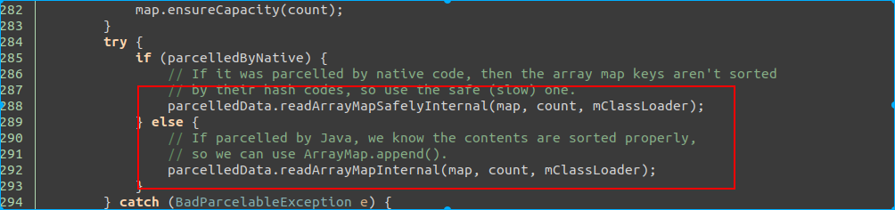

# binder

date:     20190328

author: Werther Zhang

History:

* 20200101 : 作者在实际项目中遇到了这种泄露. 后续在总结后面, 作者会想办法将实际遇到的代码调用路径和进一步的实际场景分析.

## 通过binder维护bp和bn的生命周期

同理, 变量生命周期是使用智能指针维护, 也就是记录强弱引用. 但是通过binder(匿名binder对象)传递, 如果bp还存货, 理论上bn对象就不能被释放, 则binder就需要维护这种引用关系.
下面我们来看下是怎么引用的.

### 基础概念介绍

* `binder_ref` 是 bp 在 binder driver 中的对象
* `binder_node` 是 bn 在 binder driver 中的对象.

### 匿名binder的传递

所有binder 的读写都是通过 ioctl, 对应的调用函数是 `binder_ioctl_write_read` -> `binder_thread_write`

这里有一个问题, 到此处, 我们好像没看到跟bn端匿名binder引用计数有关.

我们回到前面代码, 看下 `binder_new_node` 的实现.

这里 `BINDER_WORK_NODE`, 我们看下 `binder_thread_read`, 也就是匿名binder实现端, 从binder驱动读.

此处的cmd 是 `BR_ACQUIRE`, 我们看对应native的代码.

在 IPCThreadState.cpp 中

### Native BP 引用

在Native层, 当一个bp对象生成, 并由于智能指针, 在该进程生命周期中被持有强引用时, 相关代码如下

同步调用 incStrongHandle(), 通知binder对象, 我持有了该bp的强引用, 请持有对端bn的一个强引用.

我们看下  incStrongHandle 这个函数的实现.

参数是 `BC_ACQUIRE`,  变量是传递进来的  handle. 后续在驱动代码中, 我们会解释 `BC_ACQUIRE` 这个变量.

熟悉代码的都知道 与 binder 驱动通信的代码实现在 talkWithDriver, 而ioctl的指令是 `BINDER_WRITE_READ`.

### binder 驱动强引用传递

下面直接看 `BINDER_WRITE_READ` 在 binder 驱动端的实现

调用的是 `binder_ioctl_write_read`,  此处参数是 arg, 也就是 BP 端写入的 mOut.

下面看下 `binder_ioctl_write_read` 的实现.

此处是往binder驱动写数据, 执行的 是 `binder_thread_write`

下面看下 `binder_thread_write` 的实现

下面我们看下这几个参数在哪里用.

我们先看下 `binder_update_ref_for_handle` 这个函数的说明

`binder_ref` 对象是通过 mOut 的 handle 找到的, 我们简单看下查找方法.

通过红黑树, 在已有的所有ref中找到其 `ref->data.desc` 与我们写入 mData 中的handle 相同的值. 此处记住下, 后面会通过 `/d/binder/state` 来看下怎么找引用关系.

总之通过 mOut  的 handle 值, 我们找到了 binder 驱动中, 该 bp 相对应的对象.

下面我们继续看, 如何通过 ref 来增加对端 bn 的引用.

ref 对象中包含了 node 对象.

如果已经有强引用, 则只是将 ref 中的引用数 +1 . 

### 引用删除

从上面两段, 我们知道了 node 和 ref 分别创建时间也相应的增加引用计数的地方.

我们看下如果是减少引用, 这个变量的作用是啥

调用路径如下:

最终也是调用到 `binder_update_ref_for_handle` 函数, 接下来的调用顺序与前面引用增加不同.

如果 `ref->data.strong` 为 0, 则调用 `binder_dec_node` 来释放 ref 持有的 binder node 对象. 然后调用 `binder_cleanup_ref_olocked()` 来将 ref 释放.

是否释放node的标准是

`node->refs` 为 空, 也就是说, 所有的bp ref 对象被释放, 则 bn 的 node 也被是否.

### 疑问

前面看到, 在匿名binder传递的时候, 会创建 ref, 并将其引用+1 .而在对端通过handle, 创建bp时, 又对引用计数+1 了. 而在native的sp指针引用销毁时, 减少引用. 还有一次在哪里?

我们看下 Binder transaction 的最后一步, 处理回复的消息.

`binder_transaction_buffer_release` 这个函数比较长, 我们看下其中一部分.

这里的 `BINDER_TYPE_HANDLE` 对应的是开头匿名binder传递.

这里解释下原理. 把binder看成本地调用, 则在调用进入函数时, 参数进栈, 而在函数调用完成时, 参数出栈销毁.
此处就是出栈的原理, 在执行binder调用时, 将参数引用计数加一, 而在调用完成后, 将参数引用计数减一.

**注意下**: 上面所有的与驱动的操作, 作者都只提到将指令写入 mOut, 但是真正通知驱动是将 mOut 通过 ioctl 写入. 这里存在一个时间差, 并且如果设计得不好, 将造成数据只写入 mOut, 而未写入到驱动, 因为 mOut 是以线程为单位存放在 IPCThreadState.(换句话说, 如果有线程未发生binder相关的调用或者没调用 `flushCommands`, 则 mOut 数据将永远无法传递到驱动.)

## BinderProxy 生命周期

从上面的分析, 我们知道, BinderProxy 的生命周期将直接决定了对端BN的生命周期.

那么我们就沿着生命周期这条线, 来看下 Native 的 BinderProxy 生命周期和 java 的BinderProxy 生命周期.

### Native BinderProxy 生命周期

#### 创建

这个函数是 `getStrongProxyForHandle()`,  此处可以看到, native 的 BinderProxy 是有缓存的, 也就是说, 同一个进程的一个handle, 不会造成驱动端的引用数增加, 但是 native 层会增加引用计数并返回. 但是如果没有存在过, 则 通过 `BpBinder::create(handle)` 创建.

而传递驱动引用计数加一的操作是在下面

也就是说, 在赋值 `result = b` 的时候触发.

#### 销毁

上面是通知到驱动引用计数减一的地方.

我们可以看到只是写入到了 mOut . 也就是说, native 的 BinderProxy 在销毁时, 并不与驱动通信, 完全依赖于当前销毁 BinderProxy 的线程在下次与驱动通讯时写入数据. 那么带来一个问题, 如果这个线程没有binder通信需求, 是不是就引发了由于binder引用导致的匿名binder泄露? 我们可以带着这个问题继续下面的生命周期探索.

按照我们的理解, BinderProxy对象, 只可能有三个引用方式:

* native 业务逻辑使用
* native  Parcel 持有
* java BinderProxy 持有.

自身业务逻辑使用引起的生命周期变化, 不在我们的讨论范围内. 下面我们将假设只有 Parcel 持有和 同时 java BinderProxy 和 Parcel 持有的场景(为什么没有单独 java BinderProxy 持有场景? 可以思考下)

#####  Parcel

我们从调用 `getStrongProxyForHandle` 位置出发, 来看下 Parcel 对 native 的BinderProxy的影响.

`acquire_object` 是在 Parcel 的 `appendFrom` 调用. 该函数是将一个 Parcel 对象赋值给另一个. 直接对应的是 java 的 Parcel 对象.

看下 java 的 函数有哪些地方调用.

看下 BaseBundle  . 其实笔者已经跟过了, 这东西有点疑问, 所以此处也特地以此对象为引子来一起讨论.

上面是 `BaseBundle` 的构造函数, 我们加上 if 条件不满足, 则会走到 641 行的 `appendFrom` . 此处会创建native 层的 BinderProxy. 从这里的关系, 目前我们能得到一个结论, native 的 BinderProxy 跟 java 的 Parcel 进行了绑定.

下面我们看 java 的 Parcel 释放的时候, 会发生什么? 也就是跟 mParcelledData 的变量.

 

mParcelledData 是 `BaseBundle` 的成员变量. 所以, 如果我们假设构造 BaseBundle 后, 没有其他额外的操作, 然后释放了. 则触发finalize, 也就是在 finalize线程.

我们看下 Parcel finalize 方法:

java 层的 destroy 最终调用到native 层的 `android_os_Parcel_destroy`

我们看下 native 的 Parcel 析构方法.

 

最终调用到了 IBinder 引用计数 -1. 如上面假设的, 该 Parcel 没做个特殊操作, 则其引用计数只有 1, 此处  -1, 该函数出来将触发 IBinder 的 onLastStrongRef.

前文已经提到过,  `ipc-decStrongHandle(mHandle)` 只是将数据写入 mOut, 但并没有与驱动通信. 与驱动通信的条件是, java 的 BinderProxy 销毁, 或者 当前线程有出现 binder 通信的情况.

**所以, 这里我们提出一个疑点, 以上跟踪的代码, 是我们纯推导的, 还是在真实场景中能发生? 如果真实发生, 那该 mOut 对应的是 finalize 线程, 而该线程不会有binder通信情况, 是不是就意味着 binder 驱动引用不清楚, 进一步导致对端的 binder 实体泄露? (比如通过 Parcel 传递匿名binder).**

针对以上疑问, 我们还需要找到 :

1. java BinderProxy 的构造和释放的路径, 来确保以上路径上, 的确只创建了 java 层 的 Parcel 而没有 java 层的 BinderProxy.
2. mOut 写入驱动的条件. 看有没有可能 finalize 也出现与 binder 交互的情况. (但是, 假设有, 此处也出现延迟, 可能会造成短时泄露).

关于 java BinderProxy 的构造, 我们直接跟踪 Parcel 的 `initializeFromParcelLocked`. 为什么呢? 因为下面的注释和 `unparcel` 的代码实现.

前面我们已经推导, mParcelledData 就是可能引起的变量, 其被 GC 的时候, 可能引发泄露. 同理此处如果将 mParcelledData 赋值为 null, 则就会走释放的逻辑. 但是引用程序还需要得到 BinderProxy. 所以, unparcel 的动作一定会构造 java 的 BinderProxy (相信我!!!).

所以, 在上文 `readFromParcelInner`   的实现中, 如果 `parcel.hasReadWriteHelper()`, 则也会调用 `initializeFromParcelLocked` 并直接返回, 就没有后面的 `appendFrom` 什么事.

结合这些信息, `initializeFromParcelLocked` 将是我们接下来重点分析的点.

两个函数的实现类似, 最终都是将 Parcel 的数据读出来, 用 `readValue` 函数.

关键点来了,  根据值的类型, 此处我们看如果是binder通过 parcel 传递, 值是 `VAL_IBINDER`. 那么 `readStrongBInder` 在干啥? 调用的其实是native的 `android_os_Parcel_readStrongBinder`.

这里我们看到了, 是在构建 java 的 BinderProxy 对象. 我们依次看下 `parcel`->`readStrongBInder()` he  `javaObjectForIBinder`

熟悉的 `getStrongProxyForHandle` . 此处说明了, `parcel->readStrongBInder` 返回的是 natvie 层的  BpBinder, 也就是 native 层的 BinderProxy.

下面看下 javaObjectForIBinder

我们理下上面的关系. BpBInder 被保存在 BinderProxyNativeData, BinderProxyNativeData 对象被传递到 java 的 BinderProxy 的 getInstance 方法. 看下 java 的方法.

一个题外话: 如果  native 的 BpBinder 地址一样, 则 java 层会用同一个 BinderProxy.

`NoImagePreloadHolder`实现如上, 释放函数是  `sNativeFinalizer`. 我们看下 `getNativeFinalizer`

用的是 Cleaner.  以上代码翻译成文字的意思是, 在 java BinderProxy 的引用为 0 时, 会调用 `BinderProxy_destroy` 函数执行清理操作, 该调用是由 Cleaner 完成, 幽灵引用机制, 在 另一个线程里做, 跟 finalize 线程不是同一个.

构造就全部完成了, 看下释放的情况下, 调用 `BinderProxy_destroy`

nativeData 就是之前持有 BpBinder 引用的对象. 此处触发 BpBinder 引用计数 -1. 如果为最后一个引用计数, 则数据写入 mOut.

我们看下 `flushCommands` 是干啥的.

如果 mOut 有数据, 则将数据写入驱动.  至此, 我们搞清楚了, 如果 java 层有 创建 BinderProxy, 会依次释放 native 的 BpBinder, 最后与 binder 驱动通信通知释放对端 Binder Node 的引用, 进而释放对端的匿名binder.

但是, 回到前面 Parcel 的问题, 如果 没有调用 `unparcel` 或者 `parcel.hasReadWriteHelper()` 为 false . 就不会创建 java 的 BinderProxy, 则就不会触发  `flushCommands` 了.

所以, 我们看第二个问题, 有哪些条件能触发 `talkWIthDriver` 或者 `flushCommands `,  finalize线程是否有可能触发?

触发 `talkWithDriver` 就 4个条件:

1. flushCommands
2. 作为 binder 服务线程等在 binder 驱动上
3. 该线程退出
4. 该线程执行 transact, 作为 binder 服务的客户端.

很抱歉, finalize线程不满足后三个条件. 所以我们看  flushCommands 的调用地方, 跟 BinderProxy 相关的, 就只有 `BinderProxy_destroy`

单纯从代码推导, 会泄露. 现实场景, 笔者得实验, 或者有读者了解或者熟悉这部分代码, 可以一起讨论.

## 总结

1. 单进程持有 Bp, 驱动引用计数 +1.
2. Native BpBinder 通过RefBase 引用计数维护, 也就是 多 BpBinder 对应单 handle, 或者说单驱动引用计数.
3. java 的 BinderProxy 依据 BpBinder 地址缓存, 也是多对单结构.

一个问题: 如文章推导的, BaseBundle  传递的 Parcel 如果包含 匿名binder, 且调用者未调用 unparcel, 且无 ReadWriteHelper 函数, 就会出现无java的BinderProxy. 待 Parcel 销毁, 触发 native 的 BpBinder 销毁, 但是数据存放在finalize线程的 mOut, 导致 Binder 驱动引用计数未清 0, 进而引发对端的匿名binder泄露.

这个问题属于不匹配问题, 从设计上不应该出现, 但是从目前的分析看, Binder驱动的引用计数清 0 , 即依赖了 native 的 BpBinder 引用计数也依赖了 java 的 BinderProxy 的引用计数, 这种跨层依赖非常不合理, 是一个很奇怪的设计.

读者可以一起看下代码, 看分析是否存在问题, 或者有熟悉或者遇到这个情况的读者可以帮忙反馈实际问题场景.

## 20200101

TODO: 从公司带出这个问题的数据并补充. 能不能带出来就不确定了. 但是的确遇到了....... 解法就很多了, 可以在 BpBinder 中将 mOut 写入, 也可以在更底层根据引用计数来绝对是否 flushCommands.

