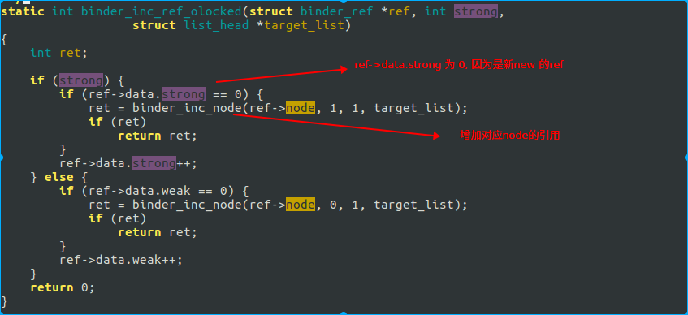

# binder

## 通过binder维护bp和bn的生命周期

同理, 变量生命周期是使用智能指针维护, 也就是记录强弱引用. 但是通过binder(匿名binder对象)传递, 如果bp还存货, 理论上bn对象就不能被释放, 则binder就需要维护这种引用关系.
下面我们来看下是怎么引用的.

### 基础概念介绍

* `binder_ref` 是 bp 在 binder driver 中的对象
* `binder_node` 是 bn 在 binder driver 中的对象.

### 匿名binder的传递

所有binder 的读写都是通过 ioctl, 对应的调用函数是 `binder_ioctl_write_read` -> `binder_thread_write`

这里有一个问题, 到此处, 我们好像没看到跟bn端匿名binder引用计数有关.

我们回到前面代码, 看下 `binder_new_node` 的实现.

这里 `BINDER_WORK_NODE`, 我们看下 `binder_thread_read`, 也就是匿名binder实现端, 从binder驱动读.

此处的cmd 是 `BR_ACQUIRE`, 我们看对应native的代码.

在 IPCThreadState.cpp 中

### Native BP 引用

在Native层, 当一个bp对象生成, 并由于智能指针, 在该进程生命周期中被持有强引用时, 相关代码如下

同步调用 incStrongHandle(), 通知binder对象, 我持有了该bp的强引用, 请持有对端bn的一个强引用.

我们看下  incStrongHandle 这个函数的实现.

参数是 `BC_ACQUIRE`,  变量是传递进来的  handle. 后续在驱动代码中, 我们会解释 `BC_ACQUIRE` 这个变量.

熟悉代码的都知道 与 binder 驱动通信的代码实现在 talkWithDriver, 而ioctl的指令是 `BINDER_WRITE_READ`.

### binder 驱动强引用传递

下面直接看 `BINDER_WRITE_READ` 在 binder 驱动端的实现

调用的是 `binder_ioctl_write_read`,  此处参数是 arg, 也就是 BP 端写入的 mOut.

下面看下 `binder_ioctl_write_read` 的实现.

此处是往binder驱动写数据, 执行的 是 `binder_thread_write`

下面看下 `binder_thread_write` 的实现

下面我们看下这几个参数在哪里用.

我们先看下 `binder_update_ref_for_handle` 这个函数的说明

`binder_ref` 对象是通过 mOut 的 handle 找到的, 我们简单看下查找方法.

通过红黑树, 在已有的所有ref中找到其 `ref->data.desc` 与我们写入 mData 中的handle 相同的值. 此处记住下, 后面会通过 `/d/binder/state` 来看下怎么找引用关系.

总之通过 mOut  的 handle 值, 我们找到了 binder 驱动中, 该 bp 相对应的对象.

下面我们继续看, 如何通过 ref 来增加对端 bn 的引用.

ref 对象中包含了 node 对象.

如果已经有强引用, 则只是将 ref 中的引用数 +1 . 

### 引用删除

从上面两段, 我们知道了 node 和 ref 分别创建时间也相应的增加引用计数的地方.

我们看下如果是减少引用, 这个变量的作用是啥

调用路径如下:

最终也是调用到 `binder_update_ref_for_handle` 函数, 接下来的调用顺序与前面引用增加不同.

如果 `ref->data.strong` 为 0, 则调用 `binder_dec_node` 来释放 ref 持有的 binder node 对象. 然后调用 `binder_cleanup_ref_olocked()` 来将 ref 释放.

是否释放node的标准是

`node->refs` 为 空, 也就是说, 所有的bp ref 对象被释放, 则 bn 的 node 也被是否.

### 疑问

前面看到, 在匿名binder传递的时候, 会创建 ref, 并将其引用+1 .而在对端通过handle, 创建bp时, 又对引用计数+1 了. 而在native的sp指针引用销毁时, 减少引用. 还有一次在哪里?

我们看下 Binder transaction 的最后一步, 处理回复的消息.

`binder_transaction_buffer_release` 这个函数比较长, 我们看下其中一部分.

这里的 `BINDER_TYPE_HANDLE` 对应的是开头匿名binder传递.

这里解释下原理. 把binder看成本地调用, 则在调用进入函数时, 参数进栈, 而在函数调用完成时, 参数出栈销毁.
此处就是出栈的原理, 在执行binder调用时, 将参数引用计数加一, 而在调用完成后, 将参数引用计数减一.