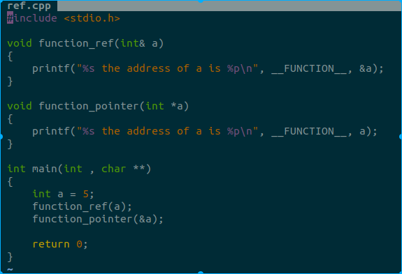
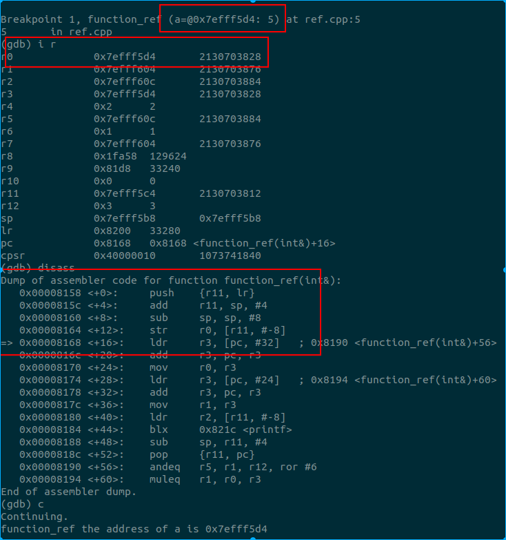
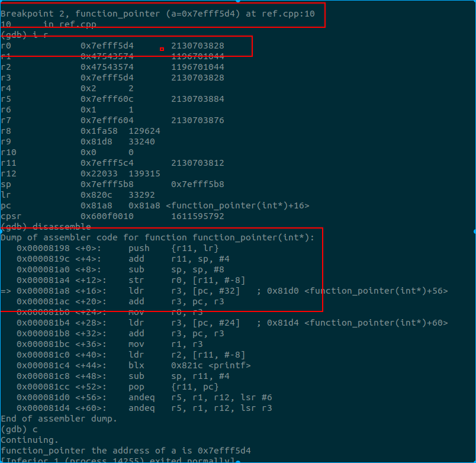

# cpp引用和指针

**作者: Werther Zhang**

## 前言

最近在看 go, 然后看到了 go 在解释值传递, 引用, 这些鬼东西, 再次进入了头晕模式. 笔者还是觉得 C 的指针和值传递好理解... 所有的都是值传递, 传递地址就变成了指针传递的概念. 但逃不掉的还是得面对, 又捡起来cpp的 引用和指针 概念, 做做实验, 确认下自己的理解.

## 引用和指针

笔者对于 引用 和 指针的理解, 非常粗暴, 引用就是更安全的指针! 而且还是在语言层面, 也可能涉及到编译器层面, 但是在汇编层面, 两者没有本质区别.

下面来个实验说明下笔者自己的理解:

上面强烈的 C 风格, 反正只是为了说明 引用传递 和 值传递.

所谓引用, 在网上非常多的说法是, 别名. 那么什么叫别名呢. 上面的例子中, `function_ref` 函数参数  a, 如果取地址, 与 `main` 函数的变量 a 地址相同. 其实说白了, 就是告诉编译器, 你给我取两个名字, 都指向同一块内存.

所以, 上面的输出, 地址是一样的.

那么在汇编层面, 引用和指针传递是否有区别?我们上gdb看下．这里采用的是android下的arm编译器, 用的是32位, 编译后在树莓派上跑. 下面的汇编是用fp做栈回溯的, 跟android真实情况有点差, 勿纠结.

引用传递, 第一个参数, r0 为 0x7efff5d4. 从 gdb 对 a 的表示也可以看出来是 引用. 我们看下汇编, 将 r0 寄存器存储到 存储器中, 这里的 r0 就是 a 的地址.

下面看指针传递

这只是笔者用基本数据做的实验. 至少基本数据的实验说明了, 引用和指针在汇编层面没有差异. 其实更深层次来说, 底下全是值传递, 要么传值的副本, 要么传地址, 都是经过寄存器进入下一帧, 所以, 理论上也不会有差异.

那么, 为什么引入引用的概念呢?　笔者对引用的理解就是，　更安全的指针!  因为指针可以做任意类型的转换, 而引用是个别名, 对于编译器而言, 引用赋值时, 这块地址的大小(类型)被限定了. 而如果通过指针传递, 则可以出现强转的情况, 编译器就不一定能拦截到.

