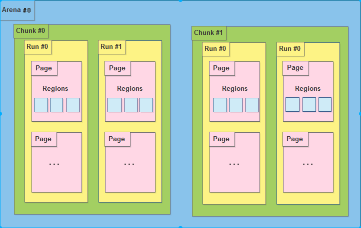
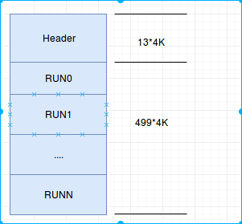
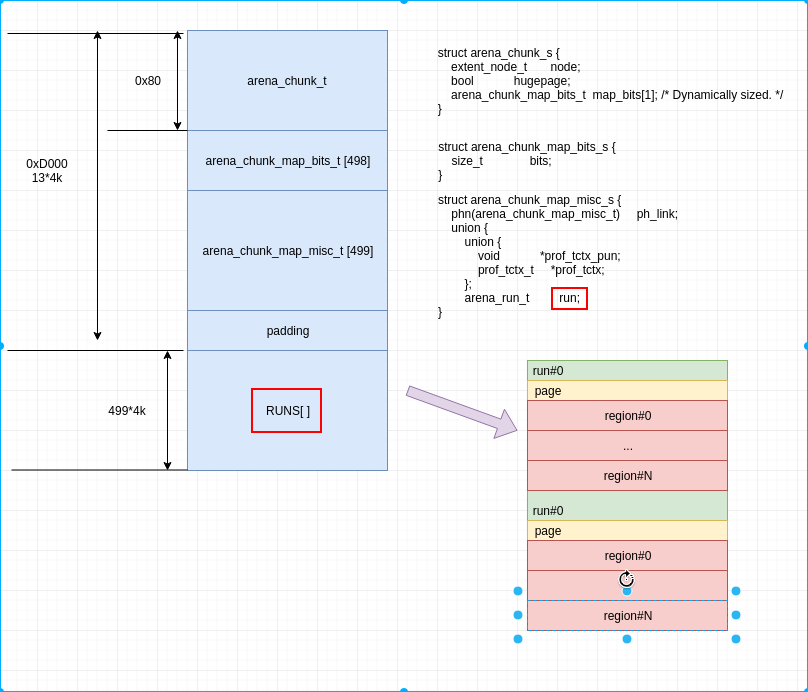
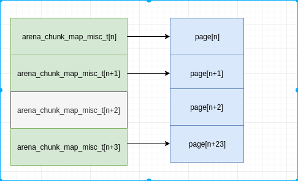
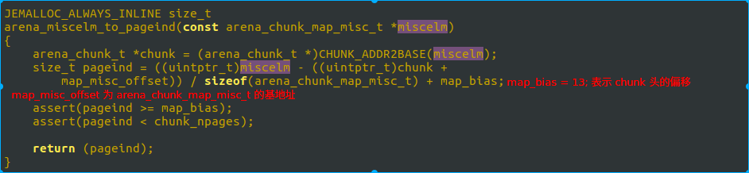

# jemalloc剖析 (未完待续)

## 什么是内存分配器

已知的比较好的内存分配器有 dlmalloc, ptmalloc, tcmalloc, jemalloc. 所谓内存分配器, 就是管理和分配内存池里的数据.
我们先看个简单的jd物流概念.

一般我们上jd买电子产品, 会直接从昆山仓库发货. 而如果我们买大件物品, 比如买个婴儿车, 作者本人买的时候, 物流就是从武汉先到昆山仓库, 再从昆山仓库到我们用户手里.

内存分配器就类似jd物流, 我们就是对应通过malloc申请内存的进程. 根据我们申请内存的大小和不同场景, 会从不同的区域划分内存给到我们.

所以, 我们知道, 内存分配一般都按大小分级, 且一般在内存内存分配器中保存着内存池用于快速申请.

## jemalloc 简介

dlmalloc 是经典的内存分配器, 其基本实现是类似kernel的伙伴系统.  而 jemalloc 是现代内存分配器, 其最大的优势是多线程分配能力. 在多核环境下, 进程效率的最大瓶颈已经变成如何用好多线程和如何避免锁. jemalloc 实现了尽可能地避免锁, 从而加快多线程环境下的内存申请和释放. 

## 基础结构

### 存储单元结构



1. 内存是由一定数量的arena来进行管理. arena 是多核实现中用来避免 cpu cache 访问失败的, 其数量一般为 cpu * 4. 也就是在4核cpu上, 如果进程的线程数在16以内, 则每个线程分配一个Arena, 避免了竞争访问.
2. 一个arena被分为若干个chunks, 一个chunks一般为2M或者4M.
3. chunk 内部包含若干runs, 作为分配小块内存的基础单元
4. run 由pages组成, 最终被划分为一定数量的region. 对于小内存请求, region 就是最后给用户的内存.

但是在Android上, go 版本最多为 1 个 arena, 而非go版本为2个arena.

我们看下 Chunk 的数据单元, 前面提到一个chunk, 一般2M或者4M, 也就是说, 内存池全部在chunk中, 我们看下是如何组织内存的.

2M 的Chunk, 其头数据包含 12 页, 剩下的 500页, 就是内存池, 用于返回给到用户的.



我们看下更详细的结构.

 

从上图可以知道, region 是内存分配的最小单元, run 包含多个 region, 是 page 的整数倍, 负责小内存的分配.这整张图其实严格意义上算小内存分配的内存管理图, 但是大内存和超大内存分配, 其实就是小内存的精简版, 所以, 我们这次主要关注小内存.

熟悉 dlmalloc 或者了解伙伴系统的同学, 应该知道, dlmalloc 在内存划分上进行了分类分级, 不同大小的内存被分类到不同的级别, 然后不同的级别有不用的内存池.
在上图中, run 就是一个级别, 比如 8byte, 则run下面挂的所有 region 都是8byte, 且所有申请内存 0~8 byte 的, 都会到 8byte 这个run级别下寻找对应的空闲内存.

所以, 类似上面的物流, 我们换一种类比, 则 region 是商品, run 是物品架, 该架子上放同类商品, 而 chunk 是一个仓库. 一个仓库里可以包含各种不同的货架. 一个货架上只能包含相同的商品.

### 管理单元

如果我们的仓库是由机器人来分类, 每次来一个订单后, 需要机器人取出指定的商品. 则我们需要设计管理单元和对应的算法, 来让我们的机器人一最快的速度取到我们想要的商品.

我们依然以小内存分配为例子.  

在 arena 中存在一个分类的概念.

```
struct arena_s {
    unsigned        ind;  // ind 表示在 arenas 数组中的位置, 前文介绍了 arena, 提到会有多个, 用于不同CPU的cache
    // ...
    ql_head(extent_node_t)  achunks;  // 链表, achunks 就是前面的仓库, 也就是说这个对象管理了多个仓库
    // ..
    arena_chunk_t       *spare;  // 最近访问的仓库, 用于快速访问

    ql_head(extent_node_t)  huge;   // 巨大内存的申请, 此处不介绍
    // ...
    arena_bin_t     bins[NBINS];    // 分类, 将所有能管理到的chunk中的run进行分类并放入到不同的 bins 中.
    // ...
}
```

我们关注 bins , 这个就是分类箱子, 就像分类表. 比如一个 8byte 的表, 里面记录的全部都是 8 byte 的货架位置, 通过这个表, 可以快速找到货架位置.

这个分类为 36 , 也就是说有 36个 bins. 我们来分别看下 bins 结构的内容和36个类别是啥.

```
struct arena_bin_s { 
    malloc_mutex_t      lock;      // 锁, 用于多线程访问时, 加锁.
    arena_run_t     *runcur;       // 当前未放满的货架
    arena_run_heap_t    runs;     // 所有未放满的货架
    arena_run_heap_t    runs_avail[NPSIZES];  // 所有未被分类的货架, 在某一类别货架不够时, 从此处获取一个新货架放商品.
    //...
}
```

从上面的结构, 很容易猜测找货架的方法, 先查看当前货架, 如果当前货架未满(还有未分配的region), 则直接找到当前货架, 否则从所有未满的货架中寻找一个离最近的(内存地址最低)货架, 并记录为当前货架.

下面看下货架的分类.

| ind | reg size | reg num | run size |
| --- | -------- | ------- | -------- |
| 0   | 0x8      | 0x200   | 0x1000   |
| 1   | 0x10     | 0x100   | 0x1000   |
| 2   | 0x20     | 0x800   | 0x1000   |
| 3   | 0x30     | 0x100   | 0x3000   |
| 4   | 0x40     | 0x40    | 0x1000   |
| 5   | 0x50     | 0x100   | 0x5000   |
| 6   | 0x60     | 0x80    | 0x3000   |
| 7   | 0x70     | 0x100   | 0x7000   |
| 8   | 0x80     | 0x20    | 0x1000   |
| 9   | 0xa0     | 0x80    | 0x5000   |
| 10  | 0xc0     | 0x40    | 0x3000   |
| 11  | 0xe0     | 0x80    | 0x7000   |
| 12  | 0x100    | 0x10    | 0x1000   |
| 13  | 0x140    | 0x40    | 0x5000   |
| 14  | 0x180    | 0x20    | 0x3000   |
| 15  | 0x1c0    | 0x40    | 0x7000   |
| 16  | 0x200    | 0x8     | 0x1000   |
| 17  | 0x280    | 0x20    | 0x5000   |
| 18  | 0x300    | 0x10    | 0x3000   |
| 19  | 0x380    | 0x20    | 0x7000   |
| 20  | 0x400    | 0x4     | 0x1000   |
| 21  | 0x500    | 0x10    | 0x5000   |
| 22  | 0x600    | 0x8     | 0x3000   |
| 23  | 0x700    | 0x10    | 0x7000   |
| 24  | 0x800    | 0x2     | 0x1000   |
| 25  | 0xa00    | 0x8     | 0x5000   |
| 26  | 0xc00    | 0x4     | 0x3000   |
| 27  | 0xe00    | 0x8     | 0x7000   |
| 28  | 0x1000   | 0x1     | 0x1000   |
| 29  | 0x1400   | 0x4     | 0x5000   |
| 30  | 0x1800   | 0x2     | 0x3000   |
| 31  | 0x1c00   | 0x4     | 0x7000   |
| 32  | 0x2000   | 0x1     | 0x2000   |
| 33  | 0x2800   | 0x2     | 0x5000   |
| 34  | 0x3000   | 0x1     | 0x3000   |
| 35  | 0x3800   | 0x2     | 0x7000   |


通过以上的bin表, 我们找到了货架, 那么, 货架中, 我们怎么知道哪个位置有我们要的商品呢?

```
struct arena_run_s {
    szind_t     binind;                        // 类别, 也就是 bin 的索引号
    unsigned    nfree;                         // 标记这个货架还有多少有效商品
    bitmap_t    bitmap[BITMAP_GROUPS_MAX];     // 商品是否有效的标记. 有效 为 1, 否则 为 0. nfree 就表示 bitmap 中 1 的个数.
}
```

从前文我们知道, `arena_run_s` 对象是在 chunk 的头, 与实际的用户数据是隔离的, 那么是如何通过 bitmap 来找到对应空闲的内存呢?

我们回到前面的图, 再看一下, `arena_chunk_map_misc_t` , `arena_chunk_map_bits_t` 和 剩下的页数都是 499 .   `arena_chunk_map_misc_t` 是对应每个页的属性, 后续会介绍其作用. `arena_chunk_map_bits_t` 包含成员 run, 而 arena 中包含的 runcur 指针, 这两个是同一个, arena 指向的实际上就是 `arena_chunk_map_bits_t` 中的run. 从上表中, 我们知道, run 可能包含多个page, 则499 page, 不会有 499个run, 也就是说 499个 `arena_chunk_map_bits_t` 中有空. 那么`arena_chunk_map_bits_t` 与其对应的多个page, 怎么关联呢? 通过偏移.  `arena_chunk_map_bits_t` 在 499个中的偏移, 与其第一个page在499个page中的偏移相等. 如下:



所以, 我们在已知 run 的情况下, 可以通过其偏移知道 `arena_chunk_map_misc_t` 的地址, 然后再计算出来其偏移. 再通过偏移计算得到该run对应的第一个page位置. 相应算法如下:



`map_bias` 就是前文 13*4K 的 13.  `map_misc_offset` 为 `arena_chunk_map_misc_t` 数组的基地址, 此处是计算出 miscelm 这个地址在数组中的位置, 然后加上 13 的偏移, 计算出 miscelm 中 run 所管理的第一个 page在 chunk 这个 2M 空间中的位置, 假设是 M. bitmap 中我们找到的第一个 1 的位置, 假设是 N, 则可以计算出来其对应的地址是 `chunk + M << LG_PAGE + reg_offset + reg_size * N` . 这个地址, 也就是期望找的货架上的商品, 也即是实际返回给用户的内存地址.

如果所有的内存请求都是上面的查找方式, 则我们看不到与dlmalloc的差异, 也看不到 jemalloc 所宣传的对多线程, 多核的优势. 那么, 多线程下, 内存是如何分配的呢?

如果把上面我们已经分析的方式, 比喻成武汉的jd物流仓库, 则线程内的内存申请, 就是昆山仓库. 小商品就直接从昆山仓库发货. 同理, 多线程的小内存分配, 实际在线程内存就可以申请, 不需要请求到 arena . 不过在 Android, go (低内存) 版本使用的是上面这套机制, 只有正常版本, 才开启了 tcache 功能, 在线程内直接申请内存.

