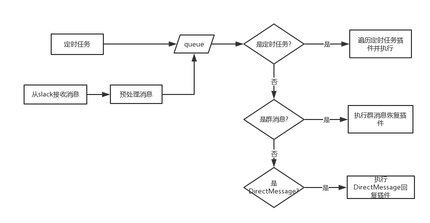
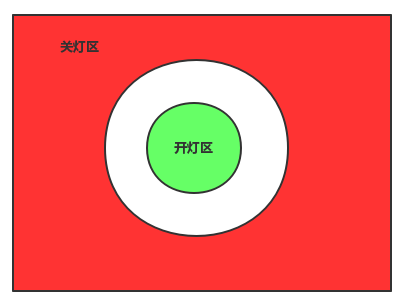

# slackbot 框架

来源: https://pengzhangdev.github.io/slackbot/

slackbot, 顾名思义, 是基于slack的bot程序, 使用python实现. 个人在[lins05/slackbot](https://github.com/lins05/slackbot)的基础上, 进行了二次开发,用于树莓派的控制中心和智能家居的控制中心. 最初选中它的原因是, 在网上看到大量的例子基于slack做远程运维的例子.

下文介绍的slackbot框架, 是包含[lins05/slackbot](https://github.com/lins05/slackbot)和个人二次开发之后的内容.二次开发的核心在于插件和组件扩充.

由于用了插件和组件的模式, 导致可以添加任意多功能的插件和组件. 所以, 功能还在持续开发中.

计划: 插件和组件跟python-fire结合, 期望实现自动解析组件的接口, 而不需要专门封装插件.

## 框架图

该模式是典型的生产者消费者模型, 生产者有2个, 一个是从slack官网接收消息并放入队列, 另一个是定时任务,隔一定时间往队列中存入指令. 消费者有10个(10线程等待在队列上), 其功能就是分别处理定时任务, 各种消息.

插件类是由PluginManager管理和加载, 从插件目录中根据配置文件中的规则加载指定的插件类, 并根据插件类的修饰函数获取对应的处理函数(定时处理函数, 消息处理函数).

## 插件和组件的实现

由于使用了修饰函数, 则被调用函数无法是类成员函数. 虽然在写插件上更方便, 但是对于插件功能强大的实现, 则需要额外封装.

在此基础上, 新添加了组件概念, 组件可以是任意的第三方库或实现(纯面向对象实现), 然后在插件目录下实现对应的插件调用该组件组成功能. 这就是pi上智能家居控制中的基础. 后续的控制实现都在该基础上扩展, 特别是定时任务.

组件中会出现多个模块被不同插件调用的场景, 这就需要组件实现单例模式(组件初始化参数通过配置文件指定). 单例模式的实现,在python2和python3上不同, 由于目前全体切换到python3上, 实现上使用了metaclass, 但是实际上重写new方法的实现也是可以的. 特别注意, 单例实际上是直接返回了内存对象, 但依然会继续后续的`__init__`, 所以必须添加标记来表示已经初始化变量.

## 插件列表

智能家居的主控为homeassistant, 这是一个开源的框架, 并且支持开源协议, 小米系列和yeelight系列大部分都能直接添加, 少量需要hack下.

所有智能家居模块存放在 `component/ha/`, slackbot与homeassistant通过rest API 通信. 所有的请求都是slackbot请求发起. 

所有的智能家居设备都可以通过slackbot远程控制开关.

后面列出的是组件列表, 列表中组件组合不同可以产生不同的插件, 比如:

1. 日照状态 + 家庭人员在客厅状态 + 灯具控制 = 太阳下山客厅有人自动开灯, 客厅没人自动关灯
2. 小米扫地机器人 + 家庭人员在客厅状态 = 家里没人, 且定时任务到, 自动开始扫地
3. 录制模块 + 播放模块 + 语音转文字模块 + 文字转语音模块 = 跟神经冰聊天并发布任务的功能

### homeassistant提供的功能列表

#### 家庭人员在家状态

获取家庭人员是否在家, 该实现其实是检测家庭成员手机的mac地址判断是否连接上路由器.

#### 灯具控制

远程控制指定灯具的开关

#### 小米扫地机器人

接入小米扫地机器人, 默认每周一三五启动清扫, 但24小时内不重启启动清扫.

#### 日照状态

也就是太阳下山与否的状态.

### 家庭人员在客厅状态

该状态的存在意义是, 个人期望家庭成员在客厅时, 自动打开客厅灯, 离开客厅时, 自动关闭客厅的.

在初期学习阶段, 解除到的主要有蓝牙广播和RFID, 都是通过三点法来定位(相关信息可以百度室内定位). 首先, 基于芯片的定位(仓库定位)不适合家庭使用, 因为家庭不可能会带着射频芯片.而蓝牙广播只有接收端才能知道自己与发送端的距离(信号衰减), 且需要三个蓝牙定位. 考虑到与蓝牙类似, 但收到环境影响更大的wifi, 测试小米路由器上可以获取到目标手机的信号强度, 则决定改用wifi划定两个圆弧区域. 小圆弧区域内开灯, 大圆弧区域外关灯, 而两个圆弧区域中间保持原状态不变. 

### 聊天机器人

分别有 ibot, tuling, xiaoi, emotibot. 但不是所有的都启用, 在聊天插件中, 选择其中的一个启动并交互.

### 文件管理器

所谓的文件管理器, 只是一个文件索引加上文件查找的工具, 额外增加了一个文件上传的功能. 文件索引使用的是jieba和whoos. 可以通过slackbot快速查找某个文件或者某本书(电子书多到自己也不知道有多少本).

### 追剧模块

不只是追剧, 也是追电影. 电影豆瓣7.0以上才推送, 而剧是家里政委喜欢的日剧, 全推((⊙﹏⊙)b),后来因为某些比较无奈的原因,  这货开始推一些老家里政委喜欢的剧, 就按需加了个功能, 黑白名单. 果然老婆是第一生产力.

### 小说模块

其实就是一个爬虫, 不停地爬取指定小说判断是否存在更新. 在个人的主页介绍中介绍了喜欢历史小说, 所以大部分都是历史类小说

### 播放模块

调用mplayer播放

### 录制模块

调用arecord录音

### 语音转文字

用了百度的api

### 文字转语

用了iflytek的API, 不得不说它们家语音做得好, 各种人物可选.

### 工具

包含了模仿浏览器打开的代码(cookie等), 实现了代理池, 并可代理访问.
