# 换个角度看init

本篇虽然归属于跟我读源码系列, 但实际是作者尝试从非源码的角度来进入init, 过程中作者会截取尽量少的源码来辅助理解(所有的代码链接指向 http://androidxref.com/9.0.0_r3/ ).


所有的UNIX系统都有一个特殊的进程, 它是内核启动完毕后, 用户态中启动的第一个进程, 它负责启动系统, 病作为系统中其他进程的祖先进程. 传统上, 这个进程被称为init. Android 也沿用了这个约定俗成的规矩.


不过Android中的init和UNIX或Linux中的init还是很大区别的, 其中最重要的不同之处在于, Android中的init支持系统属性, 病使用一些指定的rc文件(来规定它的行为). 在介绍这两个特性之后, 我们将拼凑出一副init运行流程的全景图:它的初始化过程和主循环(run-loop)中要做的操作.


另外, init还扮演着其他角色 -- 它还要花生为ueventd, watchdogd 和 subcontext. 这三个重要的核心服务也是由init这个二进制可执行文件来实现的 -- 通过符号链接的方式加载.


## init的角色和任务


和大多数unix内核一样, linux内核会去寻找一个路径和文件名预先规定好的二进制可执行文件, 并把它作为第一个用户态进程执行. 桌面linux系统中, 这个可执行文件一般是 /sbin/init, 它会去读取 /etc/inittab 文件的内容, 以获取所支持的 "运行级别"(run-levels), 运行时配置信息(单用户,多用户,网络文件系统等), 需随机启动的进程以及当用户按下Ctrl+Alt+Del 组合键时该做出何种反应等信息. Android 也使用这样一个init程序, 但是Android中的init程序和传统linux中的init程序的相似之处也就仅止于这个文件名了, 它们之间的区别如下表 所示

|              |                      Linux的/sbin/init                       |                        Android的 init                        |
| :----------: | :----------------------------------------------------------: | :----------------------------------------------------------: |
|   配置文件   |                         /etc/inittab                         | ro.boot.init_rc 指向的文件或者 /init.rc , /system/etc/init,/product/etc/init, /odm/etc/init,/vendor/etc/init 中指向的所有.rc 文件以及导入的文件 |
|   多种配置   | 支持"运行级别"概念, <br>每个运行级别都会从 /etc/底下加载不同的脚本 | 没有运行级概念, 但是有触发器(trigger)和系统属性提供了配置选项 |
|    看门狗    | 支持通过respawn关键字定义过的守护进程会在退出时重启 -- 除非该进程反复崩溃, 在这种情况下, 反复崩溃的进程会被挂起几分钟 | 服务默认是自动重启 除非启动脚本中显示使用了 oneshot 参数. 服务还可以使用critical 参数, 这会使系统在该服务连续崩溃时重启系统. |
| 收容孤儿进程 | 支持: init会调用wait4()系统调用获取返回码, 并避免出现僵尸进程 | 支持: init注册了一个SIGCHLD信号处理函数. SIGCHLD 信号是在子进程退出后由内核自动发送的.大多数进程会默默第调用wait(NULL)清理掉已退出进程, 而不去管退出码是什么 |
|   系统属性   |                            不支持                            | init 通过共享一块内存区域的方式, 让系统中的所有进程都能读取系统属性(通过 getprop), 病通过一个名为 "property_service" 的 socket 让有权限的进程能够(通过 setprop) 写相关的属性 |
|  分配socket  |                            不支持                            | init 会绑定一个UNIX domain socket (支持dgram, stream 和 seqpacket)提供给子进程, 子进程可以通过 android_get_control_socket 函数获取到它 |
|   触发操作   | 不支持: linux只支持非常特殊的触发操作, 比如 ctrl+alt+del 和 UPS 电源事件, 但是不允许任意的出发操作 | 支持: init 可以在任何一个系统属性被修改时, 执行记录在trigger语句块中的指令 |
|  uevent事件  |          linux依靠的是hotplug守护进程(通常为 udevd)          |     init 会化身为 ueventd, 用专门的配置文件来指导其行为.     |


init 是静态链接的二进制可执行文件(可通过file命令查看). 也就是说在编译时, 它的所有依赖库都已经被合并到这个二进制可执行文件中了. 这样做是为了防止仅仅因为缺少某个库或者某个库被破坏而造成系统无法启动的情况发生. /init 在刚被执行时, 只有和内核一起被打包放在boot分区上的RAM disk(单分区, AB分区是system, 此处不讨论)被mount了上来, 换句话说, 系统中只有 / 和 /sbin, 没有动态库.


## 系统属性

Android 的系统属性提供了一个可全局访问的配置设置仓库(类似windows注册表).  与init相关的源码中的 property_service.c 中的代码, 或按下表中给出的顺序, 从多个文件中加载属性.

|                             文件                             |                           加载时机                           |                             内容                             |
| :----------------------------------------------------------: | :----------------------------------------------------------: | :----------------------------------------------------------: |
|                         $device_tree                         | [process_kernel_dt](http://androidxref.com/9.0.0_r3/xref/system/core/init/init.cpp#662) | device tree 中定义的property, 全部转换为 ro.boot. 前缀的property |
|                           cmdline                            | [process_kernel_cmdline](http://androidxref.com/9.0.0_r3/xref/system/core/init/init.cpp#663) | cmdline中定义的property, 全部转换为 ro.boot. 前缀的property  |
| /system/etc/prop.default 或者 /default.prop , /product/build.prop, /odm/default.prop 和 /vendor/default.prop | 在init的[main](#http://androidxref.com/9.0.0_r3/xref/system/core/init/init.cpp#701)函数中加载.除了从根读取, 其余分区必须在device-tree中定义并在 [DoFirstStageMount](http://androidxref.com/9.0.0_r3/xref/system/core/init/init.cpp#612)阶段被挂载, 否则property加载失败. |                          初始设置.                           |
| /system/build.prop, /odm/build.prop, /vendor/build.prop, factory/factory.prop |                   init.rc 中 post-fs 阶段                    |         除了factory.prop 是只加载ro前缀, 其余全加载          |
|                   /data/property/persist.*                   |                 late-init 或者 data解密完成                  |        重启后不会丢失的property, 必须加上前缀persist         |

注意: 各个文件的加载顺序是非常重要的, ro前缀的property早加载的生效, 而非ro前缀的property晚加载的生效.


因为init进程是系统中所有进程的祖先, 所以只有它才天生适合实现系统属性的初始化. 在它刚开始初始化的时候, init中的代码会调用 [property_init()](http://androidxref.com/9.0.0_r3/xref/system/core/init/property_service.cpp#103)去安装系统属性. 这个函数(最终)会调用 [map_prop_area_rw()](http://androidxref.com/9.0.0_r3/xref/bionic/libc/system_properties/prop_area.cpp#map_prop_area_rw), 打开 `PROP_FILENAME`  ( 这个定义是 `/dev/__properties__` ) 底下的所有文件, 在关闭文件之前, 调用mmap(2) 以读写的方式映射到内存.  而需要读的进程, 则是调用[__system_properties_init](#http://androidxref.com/9.0.0_r3/xref/bionic/libc/bionic/system_property_api.cpp#47)   , 在 bionic 中被调用([__libc_init_common](#http://androidxref.com/9.0.0_r3/xref/bionic/libc/bionic/libc_init_common.cpp#134)). 下面是模拟器中的输出.

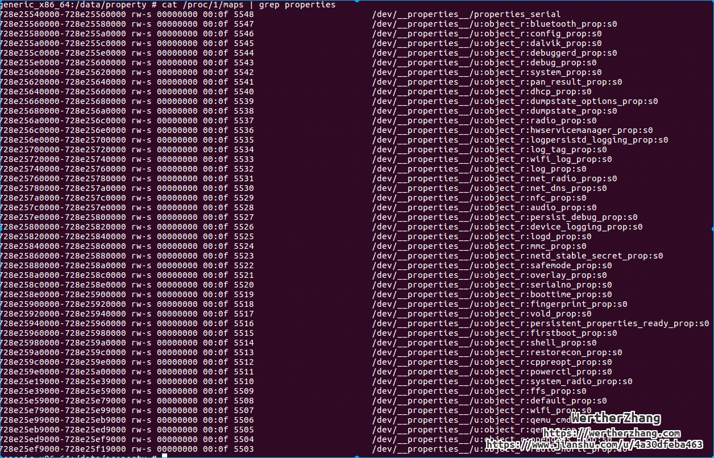


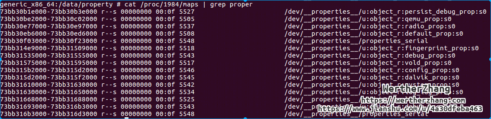


上面是基于共享内存实现了读操作, 下面我看下写操作. init 专门打开了一个专用的unix domain socket -- /dev/socket/property_service. 只要能连上这个socket, 任何人都能对它进行写操作(0666, u:object_r:property_socket:s0). 这些写入的命令会直接送给init, init会先检查 socket 调用者有没有设置属性的权限(selinux/uid/gid), selinux的相关权限在 /property_contexts 中.


下面我们看下通过socket执行proeprty set 的strace输出, 其中涉及通信协议部分不过多介绍.

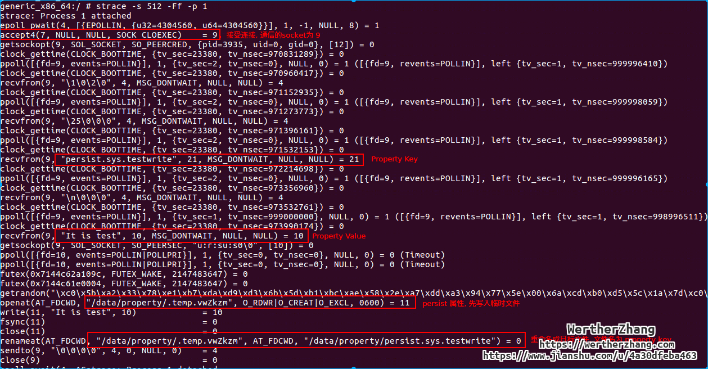

最终写入的文件如下:


上面我们看到, persist属性是写入 /data/property, 这也是为什么persist属性在重启后依然生效. persist 这个关键字, 我们可以称其为伪前缀, 真正property的前缀是 sys 这个关键字, 除了sys, 还有usb, radio等前缀关键字, 用来区分功能和权限的(比如前图的selinux权限). 具体的前缀关键字此处不细说, 读者可自行阅读代码研究, 下面介绍下几个伪前缀.

* persist 前缀. 保存在 /data/property 目录, 重启后依然生效.在data解密后或者late-init阶段加载.
* ro 前缀. 只读属性, 类似C/CPP中的常量定义, 它能且只能被设置1次, 这类属性一般尽可能早设置. 依据前文的加载顺序, 在有两个相同的ro前缀property时, 前面加载的生效, 而非ro前缀的property, 后面加载的生效.
* ctl 前缀. 这是方便控制init中的服务而设立的 -- 通过把相关服务的名字设置为 ctl.start 和 ctl.stop的值, 就能方便地启动和停止指定服务. (命令行中的start和stop实际上就是通过该property来设置.) 这种能力是受selinux控制的具体的权限定义在 [property.te](#http://androidxref.com/9.0.0_r3/xref/system/sepolicy/prebuilts/api/28.0/public/property.te), 有兴趣可以看下, 所有的property相关权限定义都在这个文件中.

这就是为啥前面说的, persist属性的property必须在data分区解密完成后才能加载. 同样带来的一个问题是, core类别的服务, 最好不要使用persist属性控制其逻辑, 如果真有需要, 得考虑data解密的问题和property重新加载更新的情况.

下面, 我们依然用strace, 来跟一下 ctl.start 的strace


## rc 文件

init的主要操作是加载它的配置文件, 并执行配置文件中的相关命令. 传统上的主要配置文件 /init.rc . 但是在 最新版本的系统上, 其配置文件的路径还包含 /system/etc/init , /vendor/etc/init 和 /odm/etc/init, 配置文件模块化了, 不同服务有单独的rc配置文件.也就是说, 前面的三个路径是init中写死的导入路径, 其余的rc文件可以通过关键字import导入.


从上面的截图, 我们可以看到, 有参数有两个对象, 分别是 ActionManager 和 ServiceList, 分别对应init需要执行的命令列表和管理的服务列表.


### import trigger(action) and service

这里我们将trigger和action合并的原因是, trigger会触发action, 本质相同, 而且从代码层面看, rc文件就是分为三大语句 块, import, trigger 和 service.


import 关键字修饰的就是import语句块, 其作用是导入其他rc并解析执行.

on 关键字修饰的就是trigger语句块, 后面跟着一个参数 -- 这个参数既可以是预先规定的各个启动阶段(boot stage) 的名称, 也可以是property的关键字, 后面跟冒号加 "属性名称=属性值"这样的表达式(这种情况的意思是, 如果property被设置为当前值, 则触发trigger定义的action). 预先定义的启动阶段如下, 此处只给出AOSP的标准流程, 各个厂商可能会改动. 后面会提供方法查看改动后的流程.

service 关键字, 定义的是由init启动的各个进程服务名字, init会根据相关的命令启动相关服务进程, 也可以根据参数(OPTIONS) 修改服务的状态. 前文实验的bootanim服务, 就是这里定义的.


下面我们对以上三个section, 简单展开介绍下, 基本上了解了这三个, rc文件的结构就了解了.


我们先看一下, import关键字解析rc文件的顺序.

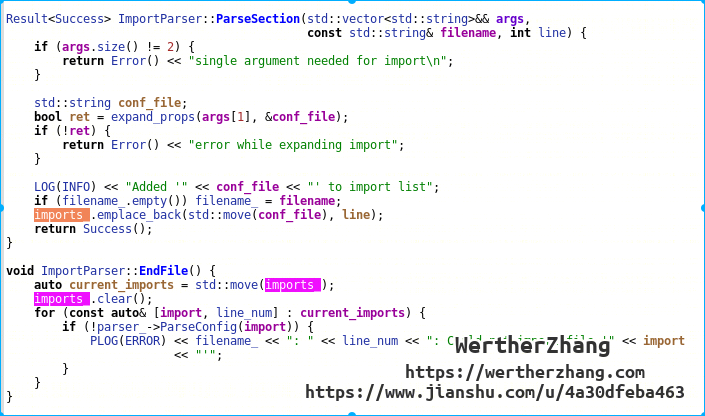


从上面代码看, 每解析完成一个rc文件, 就会按照import顺序解析其import进来的rc文件. 下面看个例子

```
# A.rc
import b.rc
import d.rc

# b.rc
import c.rc
```

其真实的加载顺序是,  a.rc -> b.rc -> c.rc -> d.rc

我们来看下init的README.md中关于import顺序的伪代码:

```
fn Import(file)
  Parse(file)
  for (import : file.imports)
    Import(import)

Import(/init.rc)
Directories = [/system/etc/init, /vendor/etc/init, /odm/etc/init]
for (directory : Directories)
  files = <Alphabetical order of directory's contents>
  for (file : files)
    Import(file)
```


下面看下 on 关键字, 也就是trigger. 首先看下aosp定义的启动阶段(基本的), 除了charger的阶段, 其余阶段存在先后顺序:


| 启动阶段     | 内容                                                         |
| ------------ | ------------------------------------------------------------ |
| early-init   | 初始化的第一个阶段，用于设置selinux 和 OOM                   |
| init         | 创建文件系统, mount节点以及写内核变量                        |
| late-init    | 触发各种trigger                                              |
| early-fs     | 文件系统准备被mount前需要完成的工作                          |
| fs           | 专门用于加载各个分区                                         |
| post-fs      | 在各个文件系统(data除外)mount完毕后执行的命令                |
| post-fs-data | 解密/data分区(如果需要), 并挂载                              |
| early-boot   | 在属性服务(property service)初始化之后, 启动剩余内容之前需要完成的工作 |
| boot         | 正常的启动命令                                               |
| charger      | 当手机处于充电模式时(关机情况下充电), 需要执行的命令         |

我们单独把 late-init 拎出来看下, 有兴趣的可以更深入看下每个trigger所执行的代码.


相信如果看过rc文件, 都会知道每个rc文件中都有trigger, 那么同名trigger的执行先后顺序是如何的呢? 下面给个结论, 和不需要看代码就知道顺序的方法.

结论: 按照rc文件的加载顺序, 执行同名trigger底下的命令.

查看方法: 通过命令 dmesg -w 监控启动流程, 然后我们过滤关键字 "processing action", 这个关键字即展示了各个trigger(启动阶段)的先后顺序, 也展示了各个rc文件中同名trigger的执行顺序.


下面看下 proeprty的trigger, 一个典型的例子就是 usb config, 语法很简单, 冒号后面的property同时为true, 触发执行命令.


看到上面的例子, 读者一定很想问, 既然有 `&&` 操作符, 是否有 `||` 操作符呢? 很抱歉, 没有呢.

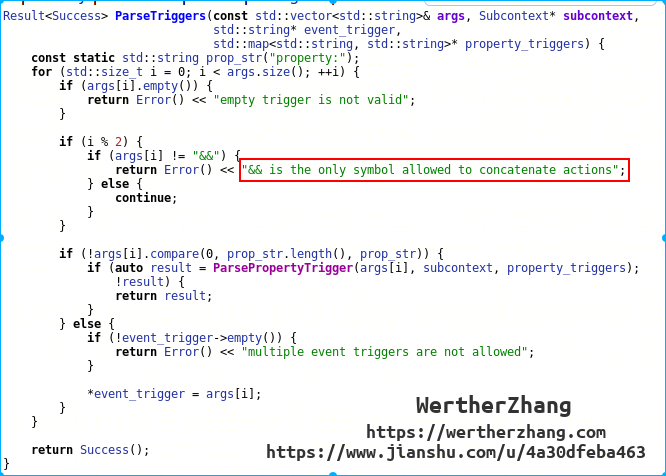


关于trigger下面挂的action (命令集), 我们在后文再看, 我们先把最后一个语句块 service 过一遍.

还是以 bootanim 为例子:

```sh
# /system/etc/init/bootanim.rc
service bootanim /system/bin/bootanimation
    class core animation
    user graphics
    group graphics audio
    disabled
    oneshot
    writepid /dev/stune/top-app/tasks
```

其格式如下:

```
service name  binary_path
	options
```

其中 name, 就是 init 维护的服务列表, 可以通过 start 和 stop 启动和停止服务.

binary_path  就是真实的可执行文件路径.

optinos 主要是 class, user, group 等关键字, 会在后文对这些关键字做介绍.


所有 定义了的 service, 都会被init管理, 也就是说, init会监听其退出的消息, 并根据options, 执行对应的异常处理逻辑, 此处逻辑不细讲, 读者有兴趣可以自行阅读代码.


### trigger 命令集

trigger 命令集也叫init命令集, 其实就是init.rc中所有可执行命令. 我们重点关注下, 定义了哪些命令, 并且命令是如何被使用的.

命令列表定义在 [BuiltinFunctionMap::map](#http://androidxref.com/9.0.0_r3/xref/system/core/init/builtins.cpp#1030), 下面看个例子, 具体命令列表大家自己跳转到源码:


如果想追寻各个参数的含义, 可以查看代码 [FindFunction](#http://androidxref.com/9.0.0_r3/xref/system/core/init/keyword_map.h#39) 和 [Command](#http://androidxref.com/9.0.0_r3/xref/system/core/init/action.cpp#52).


后面如果遇到对应的命令, 会进行简单的介绍. 具体各个命令的用法, 请参考init的 README.md.


### service 的 option 集

option 合集定义在 [Service::OptionParserMap::map](#http://androidxref.com/9.0.0_r3/xref/system/core/init/service.cpp#717), 我们重点关注下几乎所有service都会用到的option:

* class . 该service所属的类别, 字符串, 如果未设置, 则默认为 default. 可通过 `class_start` 来启动某个类别的服务.
* user. 指定该进程运行时所属用户
* group. 指定该进程运行时所属的组.
* critical. 指定该进程属于critical类型, 该类型的服务连续4次崩溃会导致系统重启.
* disabled. 指定该服务默认不启动. 如果不设置该属性, 服务都会默认启动.  原理是, 前文的命令集中有命令 `class_start`,  通过 `class_start core` , `class_start main` 等方法启动服务, 而  [class_start ](#http://androidxref.com/9.0.0_r3/xref/system/core/init/builtins.cpp#101)命令无法启动 disabled 服务, 这是该命令区别于普通的 `start` 命令的地方. 
* oneshot.  指定该服务如果退出后不自动重启(触发位置为子进程退出的信号处理函数). 其他情况下(比如 start 或者 class_start 命令), 依然可以再次启动该服务.
* onrestart. 该flag表示如果服务重启, 则重启onrestart后面的服务. 但是通过 `{class_}stop` 或者 `{class_}reset`  命令导致的重启, 不会重启[onrestart定义的相关服务](#http://androidxref.com/9.0.0_r3/xref/system/core/init/service.cpp##362). 


额外介绍下 `shutdown` 选项, 目前只有参数 critical, 且如果被置上该选项, 在关机重启的流程中, 最后被结束. 按理说, servicemanager 重启, 所有注册的binder服务都需要重启, 但是在模拟器上测试发现, 重启 servicemanager, 系统就无法启动了. 应该是跟部分native进程通信方式从socket切换到binder有关.


### 组合键 keychords


keychords 也是 service 的option 字段, 这里单独拎出来讲的原因是, 这是类似后门一样的神奇功能, 它允许用户在按下某几个组合键时, 启动某些服务.  "组合键" 当前被定义为在[adbd启动](#http://127.0.0.1:8080/source/xref/aosp/system/core/init/keychords.cpp#69)的情况下同时按下某些按键. 每个按键在linux的输入子系统上都有对应的扫描码, 此处 114, 115, 116 就对应的 VOLUME_DOWN, VOLUME_UP 和 POWER 键的扫描码(扫描码和framework KEYCODE对应表 [Generic.kl](#http://127.0.0.1:8080/source/xref/aosp/frameworks/base/data/keyboards/Generic.kl)).

要支持组合键, 则必须存在 /dev/keychord , 且adbd进程正在运行. 如果需要可以通过改代码, 强制该后门全局启用.


## mount 文件系统

### 文件系统挂载顺序

本文忽略AB系统, 如果有兴趣了解, 请阅读作者的另一篇文章, 关于AB升级和AB分区.

我们先来看一下模拟器中的分区挂载.

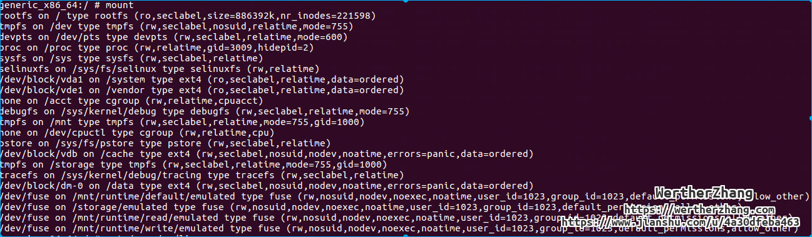

mount 命令实际读取的是 /proc/mounts

system 分区之前的挂载, 在init的第一阶段执行, 不详细说明了.

而system/vendor/data分区的挂载, 由于阶段的不同, 挂载信息的来源不同, 此处仅针对模拟器中的情况来进行秒数, 读者可根据相关代码在实际的设备中尝试研究.

system 和 vendor 的分区挂载信息保存在 /sys/bus/platform/devices/ANDR0001:00/properties/android/fstab .

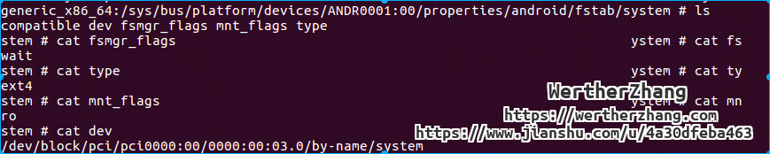

从上图可以看到,  挂载的设备路径, 信息和文件系统类型.

那么这些信息的路径数据从哪里来的?


准确地说, 是传递给kernel的参数中, 带了该信息学.

```
generic_x86_64:/ # cat /proc/cmdline                                           
qemu=1 androidboot.hardware=ranchu clocksource=pit android.qemud=1 console=0 android.checkjni=1 qemu.gles=1 qemu.encrypt=1 qemu.opengles.version=196608 cma=262M androidboot.android_dt_dir=/sys/bus/platform/devices/ANDR0001:00/properties/android/ ramoops.mem_address=0xff018000 ramoops.mem_size=0x10000 memmap=0x10000$0xff018000
```

也就是说 system 和 vendor 是在 [DoFirstStageMount](#http://androidxref.com/9.0.0_r3/xref/system/core/init/init.cpp#612) 时挂载, 也是最早挂载的.


cache 和 data 分区是定义在  fstab.{hardware} 中


此处忽略带有voldmanaged关键字, 因为该关键字是指这条挂载信息由vold管理并挂载, 而不包含该关键字的都是由init管理并挂载.

那么fstab是什么时候被解析和挂载的呢? 在 init.{hardware}.rc 中 on fs 阶段的 [mount_all](#http://androidxref.com/9.0.0_r3/xref/device/generic/qemu/init.ranchu.rc#2) 命令挂载的.


如果data分区块加密了呢? 刚开机的时候, 会先输入密码, 然后再出现开机动画, 最后出来真实系统. 也就是说, 如果data分区加密了, data分区就是最后被挂载的. 我们在下节介绍该过程中, 分区挂载的一些变化.


### 为什么无法挂着data会导致安全启动

这个问题, 其实也是触发安全启动的条件.我们先来看下输密码界面的挂载信息.


关注下data分区, 当前是挂载成tmpfs, 也就是内存文件系统. 换言之, 安全启动过程中, 无法挂载data分区, 然后挂载了内存分区, 用于启动一个小的ui系统输入密码. 那么什么条件下切换到安全启动界面呢?正常情况下, 在检查到fstab中有加密选项, 并且分区别检测到加密, 就会进入安全启动逻辑. 但是还有一种异常情况, fstab中有可加密选项, 但data挂载失败.


此处, 如果data分区无法被挂载, 并且fstab中有标记data分区是可以被加密的, 那么就会挂载tmpfs, 并尝试解密处理.

解密和挂载data分区的流程在 [cryptfs_restart_internal](#http://androidxref.com/9.0.0_r3/xref/system/vold/cryptfs.cpp#1540) , 其中, 先停止main类型的服务, 然后挂载data分区, 最后再重新启动main类型的服务, 全程通过property `vold.decrypt` 来控制服务的启动和配置. 我们简单看下property的变化.

在解密分区前, 设置property为  trigger_reset_main


在解密挂载data分区

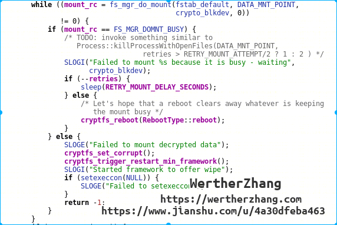

 在解密挂载完成后, 设置property


这里可以对应上前文的data分区挂载后, init程序会加载 persist 属性的property.


感兴趣的同学可自行阅读下该property的变化和 rc文件中相关的trigger, 结合前文来回答下面的问题:

1.  在挂载data分区之前是如何关闭所有需要用到data分区的服务的?
2. 解密挂载分区后, 又是如何重启服务的?
3. 是会重启所有的main类型服务吗? 阅读rc文件, 找出你觉得在解密后无法被重启的服务(假设data解密前已经启动)
4. onrestart 标记的服务是否会被触发重启?

### 扩展: 命名空间

如果大家手上有最新aosp的模拟器或者机器, 可以发现, 可以使用su命令的. 以前 root 的基本方式就是在system分区中丢进去一个su, 然后应用就可以执行提权了. 在还没有引入selinux的年代, Android为了应对该方法, 使用了内核的namespace概念, 也就是挂载空间的隔离.下面我们以最新的aosp来看下namespace的例子:

我们先敲mount命令, 看下挂载的情况:

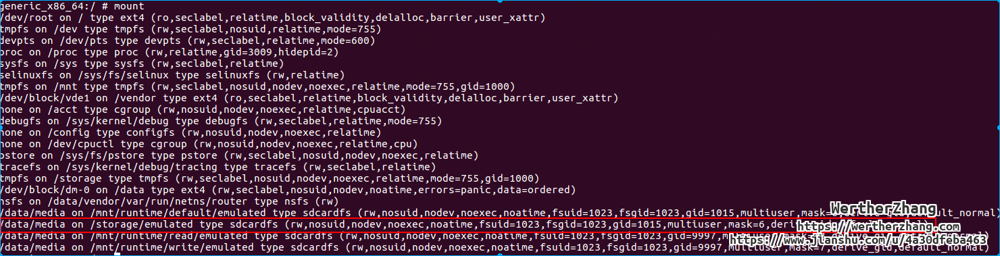

下面挑两个应用, 我们看下这个应用的命名空间里挂载情况.

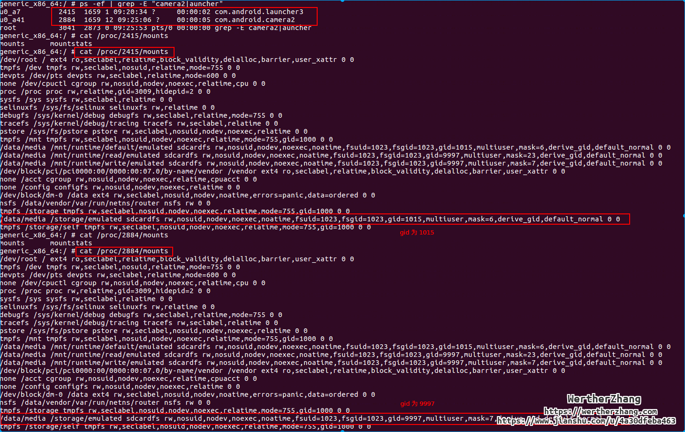 

关注下 gid, 不同进程, 挂载的参数不一样. 我们一定好奇两点:

1. 真实看到的目录是否一样?
2. 为什么会不一样?

我们先看第二个问题,  默认的挂载到root命名空间, 按照fork继承父进程资源的规则, 同样的子进程就会继承父进程的命名空间和挂载信息. 在函数 [com_android_internal_os_Zygote_nativeUnmountStorageOnInit](#http://androidxref.com/9.0.0_r3/xref/frameworks/base/core/jni/com_android_internal_os_Zygote.cpp#913), 会执行命名空间隔离(类似写时拷贝), 之后在 [MountEmulatedStorage](#http://androidxref.com/9.0.0_r3/xref/frameworks/base/core/jni/com_android_internal_os_Zygote.cpp#381) , 挂载对应的分区.  这里额外得提一下, vold 也会往命名空间中挂载, 特别是动态权限申请的时候, vold 就动态进行分区挂载, 相关代码在 [remountUid](#http://androidxref.com/9.0.0_r3/xref/system/vold/VolumeManager.cpp#443). 

关于第一个问题, 我们写个程序来真实体验下namespace 带来的神奇.

我们还是以上面的luancher和camera应用为例子来看下.

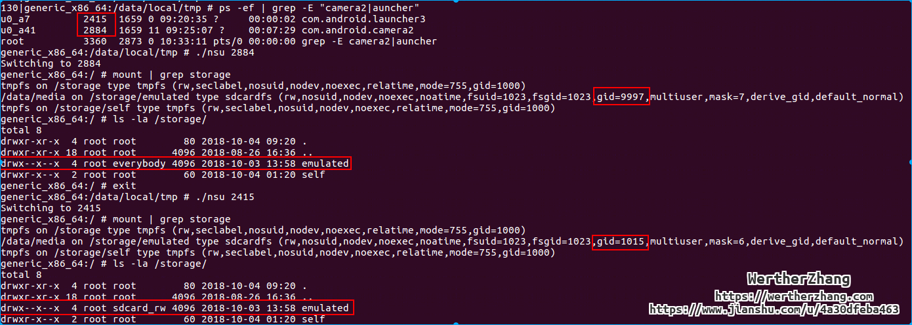

上面, 我们写了点代码, 分别切换到luancher和camera应用的命名空间, 然后通过mount命令和 ls 命令, 我们看到了权限完全不同的目录. 这就是命名空间的神奇.


## 总结


作为大多数守护进程的样板, init代码的执行流程完全遵循建立服务的经典模式: 初始化, 然后陷入一个循环中, 而且永远不退出.


* 检查自身的可执行程序是不是被当初ueventd, watchdogd 或者 subcontext, 如果是, 则转到对应守护进程的主循环函数, 后续代码流程不执行
* 创建/dev, /proc, /sys 目录, 并挂载
* 挂载设备树中定义的fstab信息, 也就是前文提到的, 挂载system分区和vendor分区
* selinux初始化
* 创建 /dev/.booting 文件, 在启动完毕后, 该文件会被删除(在 firmware_mounts_complete, 也就是在 early-boot之前)
* property_init  . 初始化 property service
* 将 dt 和 kernel cmdline的信息导出到proeprty, 规则是将所有的 androidboot.xxxx 导出成 ro.boot.xxx
* 再次初始化 selinux
* 初始化信号处理函数, 用于处理子进程退出信号
* 加载 一堆 default.prop 文件
* 解析所有rc文件
* 将early-init的trigger添加到trigger队列中
* 将 init 的trigger 添加到 trigger队列中
* 根据 ro.boot.mode (androidboot.mode) 来判断是不是处于关机充电模式, 如果是, 则不挂载文件系统且只启动charger服务.
* 进入主循环开始执行trigger的命令


下面看下主循环, 会循环依次执行下面的代码

* 执行 [HandlePowerctlMessage](#http://androidxref.com/9.0.0_r3/xref/system/core/init/init.cpp#755), 处理 property  sys.powerctl, 比如shutdown 或者 reboot
* am.ExecuteOneCommand() , 处理前文添加的trigger的action
*  RestartProcesses() ,  检查所有已经注册过的服务, 必要时重启服务
* 轮询如下三个fd:
  * property_set_fd : 也就是前文的 /dev/socket/proeprty_service, 这个socket是用来让想要设置某个属性的客户端连接并发送对应的key/value 给 init 进程.
  * keychord_fd : 用来处理启动服务的组合键
  * signal_read_fd: 它是socketpair的一端, 另一端在信号处理函数里, 在收到子进程退出信号后, 写入一端, 则epoll等待就会返回处理子进程退出逻辑.


## init 的其他角色

多个角色共用一套代码, 利用的是软链接的机制, 跟busybox一样, 通过 argv[0] 可以获取到执行的文件名字(也就是软链接的文件名), 从而知道需要执行的模块代码.

### ueventd

作为ueventd执行时, init这个程序是用来管理硬件设备的. 它需要响应内核的通知(netlink), 管理/sys伪文件系统中与各个设备对应的文件并负责让各个进程通过它在/dev/底下创建符号链接指向到这些文件. 为了完成这些操作, uevnetd使用另外的初始化脚本 uevnetd.rc 和  ueventd.{hardware}.rc .这些配置文件比init的配置文件简单多了, 只记录了哪些文件被配置成哪些权限. ueventd 会逐条处理rc文件, 并调用[HandleDeviceEvent](#http://androidxref.com/9.0.0_r3/xref/system/core/init/ueventd.cpp#283) . uevent, 还负责处理fireware的加载, 在kernel 发送 add 消息后, uevent 调用 [HandleFirmwareEvent](#http://androidxref.com/9.0.0_r3/xref/system/core/init/ueventd.cpp#282) 确认子系统是 firmware, 加载数据并发送.


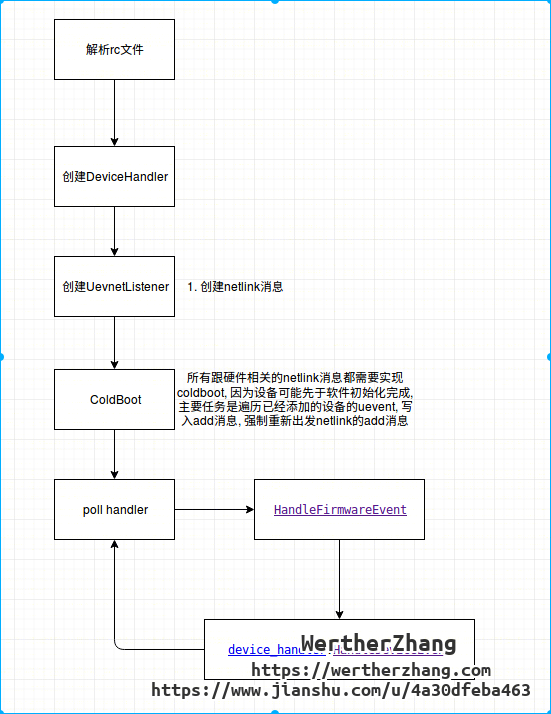


### watchdogd

和ueventd一样, watchdogd也是init的另一面. 这时, 它被用作硬件watchdog定时器（timer) (/dev/watchdog，如果有的话）在用户态中的接口. 设置一个超时（(timeout）变量, 每隔一段时 间就发送一个keepalive信号（一个""字节）。如果超过了超时变量规定的时间，watchdogd 还没能及时发送keepalive信号，硬件watchdog定时器就会发出一个中断，要求内核重启。尽 管有那么点极端的感觉，但我们要知道唯一能让watchdogd不能及时发送keepalive信号的原因 只有系统已经挂机（hang）了―这时系统很可能已经无法从挂机的状态恢复过来了，重启设备反而算是个比较简单的解决方案. 作为watchdogd时，这个守护进程只接受两个命令行参数：interval和margin―这两个参 数的初始值都是10，单位是“秒”。设备的总超时时间（(timeout变量的值）是这两个参数之和 （即，默认值为20秒).不过在超时没有接收到信息后，系统并不会马上重启，而是会再稍微等 上一小会（给系统最后一次补救的机会).

### init subcontext

该模块是在android P(9.0) 才引入的, 是为了完全隔离 system 和 vendor. 相信使用P的童鞋应该都有经历过, 某系property 无法设置或者无法读取了 (selinux权限限制), 这些都是这个模块干的.


红色框内的就是该模块. 

从上图看, 该模块是由init创建的, 我们来看下该模块是如何创建的和它的参数含义.

在init的main函数中, 有如下的代码, 用于初始化 subcontext

```cpp
subcontexts = InitializeSubcontexts();
```

该函数实现如下:


依据下面的路径和信息, 创建对应的 subcontexts, 此处会创建2个subcontexts进程, 分别用于处理 vendor 下的rc脚本和 odm 下的rc脚本. 其主要原理就是, 如果rc文件是在vendor/odm底下, 且命令需要subcontexts, 就将命令转交给 对应的 subcontexts 模块处理.


我们看下subcontexts的Fork代码. 


通过socketpair, 创建init和 subcontexts 模块间的通信.


下面我们看使用的地方, 按照我们的理解, 是要完全隔离system和vendor的权限, 那么, 主要动的是trigger.


这里是创建parser的地方, 我们看到, 主要动的其实是trigger和 service.

我们先看下 service , 主要控制的是哪些权限.


控制service重启时, 所需要执行的命令的权限.


我们再看看 ActionParser.

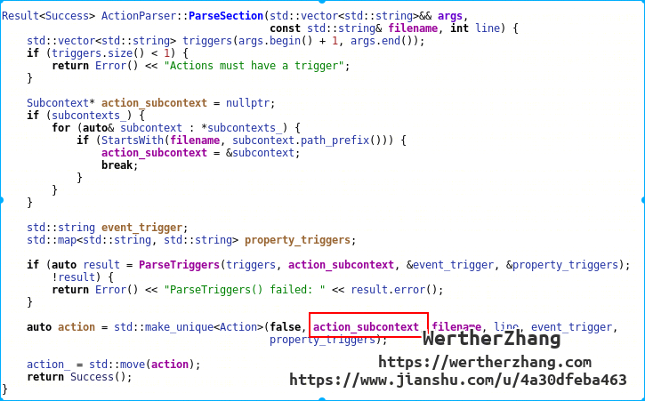

最终与service一样, 如果是在vendor/odm 底下的rc中的action, 都会被指定 action_subcontext .


我们看了subcontexts 的启动, 和 区分是普通init还是subcontexts执行的标准后, 我们看下, 一个vendor底下的action, 如何被执行的.


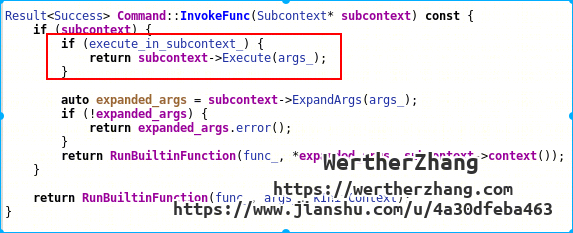

调用subcontexts 的 Execute 函数, 其实就是通过socketpair, 通知 另一个进程帮忙执行, 然后将结果返回.

而 `execute_in_subcontext_` 该变量就是前文 [trigger 命令集] 中参数的第三列, true 为该命令需要通过subcontext执行, false 为不用.

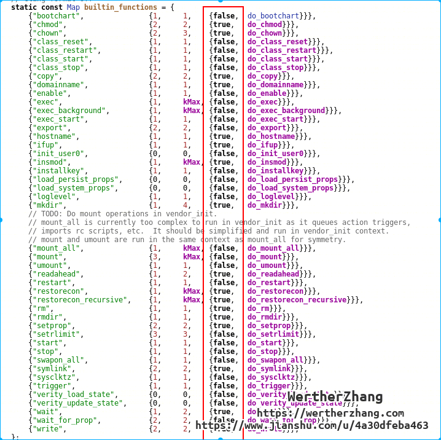


这就是为啥 刚从 O 升级 到 P后, property 包括 rc中的一些其他命令, 会出现selinux权限问题

```
type=1400 audit(1511821362.996:9): avc: denied { search } for pid=540 comm="init" name="nfc" dev="sda45" ino=1310721 scontext=u:r:vendor_init:s0 tcontext=u:object_r:nfc_data_file:s0 tclass=dir permissive=0
init: Command 'write /data/nfc/bad_file_access 1234' action=boot (/vendor/etc/init/hw/init.walleye.rc:422) took 2ms and failed: Unable to write to file '/data/nfc/bad_file_access': open() failed: Permission denied
```

